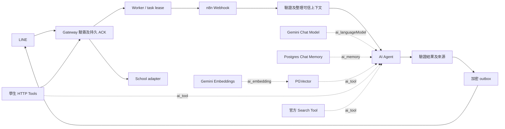

# 校園 n8n AI Agent 系統設計

更新：2026-10-08。實作進度與未完成驗收見 [Roadmap](ROADMAP.md)，部署見 [README](../README.md)。文件僅保留設計與路線圖，歷史 mock 與 Phase 1 驗證資產不再交付。

## 1. 目的與範圍

透過 LINE 提供國立臺中科技大學公開資訊問答及本人校務功能。核心為 n8n 原生 AI Agent、Google Gemini、Postgres Chat Memory、PGVector、Embeddings 與直接 HTTP Request Tools，不以 Call n8n Workflow Tool 統一包裝功能。

學校登入入口為 `https://sso.nutc.edu.tw/eportal/default.aspx`。既有校務程式參考 `nutc_student_system` 的 auth、schedule、absence、announcement service／parse，不沿用其密碼保存、自動重新登入或背景 warmup。校务 adapter 以本人 session 呼叫校方，不將既有程式 API 當作已部署的校方 API。

LINE Messaging Channel 為 `2011885580`，Login Channel 為 `2011885607`，LIFF 為 `2011885607-MccunYXG`；目前公開入口為 `https://nutc-agent.yuzen.dev/liff/`。後端驗證 LINE ID token 後建立本人 web session，不實作獨立 LINE Login callback。Login Channel 的 Published 狀態由使用者確認，不宣稱 Console 獨立驗證。

## 2. 系統責任與工作流

| 元件 | 責任 |
|---|---|
| gateway | LINE raw-body 驗簽、身分、LIFF session／CSRF、持久任務、工具權限、模型代理、outbox 派送 |
| school-adapter | 校務登入、本地 OCR、Cookie 與本人校務查詢；內部 API 不對外公開 |
| n8n | 原生 Agent、工具選擇、對話記憶、公開語料匯入及檢索 |
| PostgreSQL／pgvector | 獨立 n8n metadata DB 與 Agent DB；身分、任務、session、Memory、語料 |
| 受限公開 ingress | 僅 LINE／LIFF 所需路徑；不轉送 internal、provider 或 n8n 管理路徑 |

正式主流程 `campusNativeAgentLive` 由 `scripts/generate-live-agent-workflow.mjs` 產生；官方語料流程 `campusKnowledgeIngest` 由 `scripts/generate-knowledge-workflow.mjs` 產生。JSON 不含秘密，僅保存 credential 參照。生成不等於匯入、發布或驗收；新空環境的匯入與發布由 Docker 一次性初始化負責，不覆寫未知 instance／使用者畫布。

主流程採 Webhook → prepare／整理訊息 → Agent → completion → 回覆。原生節點包含 Gemini Chat Model、Postgres Chat Memory、PGVector Store、Gemini Embeddings，以及 student_schedule、student_absence、student_announcements、student_grades、student_leave、student_send_mail 與 official_search。各工具固定端點及操作；模型只填允許的業務參數，不得提供使用者識別、任意 URL 或 capability。

正式流程不保存 n8n execution 原文。Agent maxIterations=5、timeout=90 秒，HTTP 工具每任務最多四次；此上限用於執行資源控制，不涵蓋所有原生工具。

## 3. 身分、任務與記憶

所有人可加入 LINE Bot；已驗簽的一對一事件或已驗證 LINE ID token 自動註冊本人身分，不需要受邀名單。群組不執行私人校務功能。首次並行請求由唯一鍵與身分 row lock 保護。

LINE 入口以 transaction 寫入 inbox／task 後快速 ACK，worker 隨 gateway 啟動並派送 n8n，不設額外啟用旗標；LINE ACK 不等待模型運算。prepare／tool／complete 綁定身分 generation、task、lease、capability 及一次 prepare 檢查點；capability 只存 hash。租約 90 秒、任務最長五分鐘，每人同時只處理一個任務。重複事件不再次呼叫 Agent。

session key 由後端驗證的身分與 generation 推導，不能由匿名輸入指定。Postgres Chat Memory contextWindowLength=5 只限制模型上下文，不自動限制資料庫筆數。正式記憶最多七天，支援清除對話與撤銷；資料庫 trigger 限制原生 Memory 只能寫有效 generation。

解除綁定或 unfollow 輪替 generation、刪除本人校務 session、私人暫存與記憶、取消未交付工作。follow 不能解除既有 revoked；本人精確傳送「重新啟用」只恢復助理，不恢復舊校務 Cookie。撤銷與派送共用身分鎖。migration 015 保留舊 `invited` 欄位，但不再以它控制准入。

## 4. 校務與個人資料

LIFF 登入由後端驗證 ID token，簽發 Secure／HttpOnly／SameSite=Lax session；敏感操作檢查 Origin 與 CSRF。一個學號只能綁一個 LINE 身分，同使用者／帳號禁止並行登入。

ASP.NET ViewState／captcha／CookieJar 協定由獨立 adapter 處理，本地 `ddddocr-node` 處理五字元驗證碼，最多三輪且總計 30 秒。只有明確 captcha 錯誤可重試；密碼錯誤、鎖定或結果不明立即停止。只有校方明確拒絕帳密才計入十五分鐘兩次保護；OCR、連線或解析失敗不計入。

密碼僅用於當次登入，不 trim、不保存。Cookie 留在後端加密保存；session 最長八小時、閒置三十分鐘。學校登入帳密不進模型。

2026-10-07 使用者明確核准本人校務結果提供 Google Gemini 整理。工具回傳經本人 session／task／lease／capability 驗證的結果及 ref；回答可保存於本人隔離 Memory，最多七天，不進共享 RAG。私人 ref 與待發 outbox 加密，completion 與派送再次核對本人 session 及撤銷狀態；LIFF 頁明示資料處理方式。未登入指引及獨立 Grounding 結果由後端固定產生，不被模型替換。

## 5. 公開語料與搜尋

原生生成模型為 `models/gemini-3.8-flash`，embedding 為 `models/gemini-embedding-001`／3072 維。n8n credential 持有內部 proxy token 與 host，供應商原始 key 僅由 gateway 從根 `.env` 讀取。

官方語料初始網域為 `www.nutc.edu.tw`、`aca.nutc.edu.tw`、`student.nutc.edu.tw`、`elib.nutc.edu.tw`。管理者手動啟動匯入：固定官方 reader → hash 去重 → 原生 Gemini Embeddings → PGVector staging → 整批驗證／原子發布。只接受核定並取得原文的來源。

completion 核對本次 native observation 的來源版本、chunkId 與全文，绑定本次任務；完成及派送再次檢查來源有效性。記憶中的 sourceId 或僅存在的來源 ID 不能證明本次回答有依據。來源不足時拒答或追問。

Google 官方 Search Grounding 使用獨立的本人 LIFF 結果頁，呈現答案、來源及 Search Suggestions；主 Agent 只收到完成狀態。Grounding 不送 crawler、共享 RAG 或主 Agent Memory，不能冒充核定 RAG 原文。搜尋預設保持停用，使用獨立的 Google Search 開關，啟用前需完成供應商與搜尋結果驗收。舊 Brave adapter 不作目前搜尋部署預設。

所有工具文字均視為資料，不能擴大權限或改寫系統指令。官方 reader 與校方 client 檢查固定 host、DNS 及 redirect；Docker 可連外並不等於供應商域名 allowlist。

## 6. 錯誤及訊息體驗

依使用者要求，應用程式不再實作費用預留、用量結算、每日／累計費用上限或任務 worker 啟用開關。模型、embedding 與搜尋費用由供應商計收；保留 token／body／response 大小、timeout、工具次數及任務期限限制。Google Search 獨立開關不變，模型不擅自更換。

技術錯誤、非法輸出或來源不符使用固定安全回覆，不曝露 stack、token、Cookie 或他人資料。worker 領取任務後 best-effort 呼叫 LINE loading API（60 秒、1.5 秒 request timeout），失敗不阻擋 Agent；動畫只支援正在查看一對一聊天室的手機，HTTP 202 不代表實際可見。

Agent 每次執行由 `$now.setZone('Asia/Taipei')` 注入日期、星期、時間及 UTC+08:00；今天／明天不依舊記憶或訓練日期。LINE push 統一轉純文字，保留 URL、程式碼與一般底線／乘號。

## 7. 部署與儲存

根目錄 `docker-compose.yml` 是唯一 Compose 入口，`Dockerfile` 提供必要映像建置；不使用 infra 目錄或多層 overlay。固定 n8n 2.41.7；服務名稱、資料 volume 與 Compose project identity 保持既有環境相容，不因整理目錄重建或清空資料。

新空 n8n metadata database 在 server 啟動前，由 `n8n-init` 使用同版本官方 CLI 建立四組加密 credentials、匯入兩個正式流程並發布主流程；語料流程不自動執行。秘密只經環境變數與 stdin 傳入，不落匯入檔。首次 owner 仍由 editor 設定。初始化以 PostgreSQL advisory lock 與 `campus_bootstrap.state` 狀態保護；已有 metadata schema 或完整初始化標記時只讀略過，中斷留下 pending 並阻止自動重試，避免覆寫人工修改。既有環境不自動升級工作流或同步 `.env` 到 credentials。

n8n metadata 與 Agent 使用不同 database／role。Agent DB 保存正式身分、inbox／task／outbox、LIFF／學校 session、Memory、來源版本、staging／chunks。SQL migration 屬應用 schema，不屬 mock；更新須核對 checksum，不接受未知既有 schema。已套用的歷史 migration checksum 不改寫；其中舊費用帳本 schema 僅為相容既有資料保留，現行服務不再讀寫。部署操作不得使用 `down -v` 或重置資料。

gateway 僅綁定 host loopback 3100，school-adapter 無 host port；n8n 管理入口僅 loopback。公開入口 `public-ingress` 與 `tunnel` 都由同一 Compose 啟動、健康檢查及自動重啟，不需主機 Node.js／pnpm／cloudflared 或額外程序。ingress 僅代理固定 gateway 與 LINE／LIFF 路徑；兩者沒有 host port，也不加入後端 management network。ingress 以獨立 internal network 連 gateway，不與 n8n／school-adapter／Postgres 共用網路。Tunnel ID 從根 `.env` 的 locally-managed `TUNNEL_CRED_CONTENTS` JSON 取得，hostname 從 `PUBLIC_ORIGIN` 取得；只產生不含秘密的暫存設定。Tunnel 等待 ingress 健康，並以 cloudflared `/ready` 檢查 Cloudflare 連線。新網域的 DNS／Tunnel 由管理者先設定，程式不修改 Cloudflare 帳戶。秘密集中根 `.env`，不進 build context、Git 或工作流 JSON。

目前是本機 Docker 加受限公開 ingress，不是遠端正式 Linux 部署。健康檢查、typecheck、靜態圖結構或合成測試都不能代替真人 LINE／LIFF、模型語意、搜尋整合、隔離、負載及備份還原驗收。
