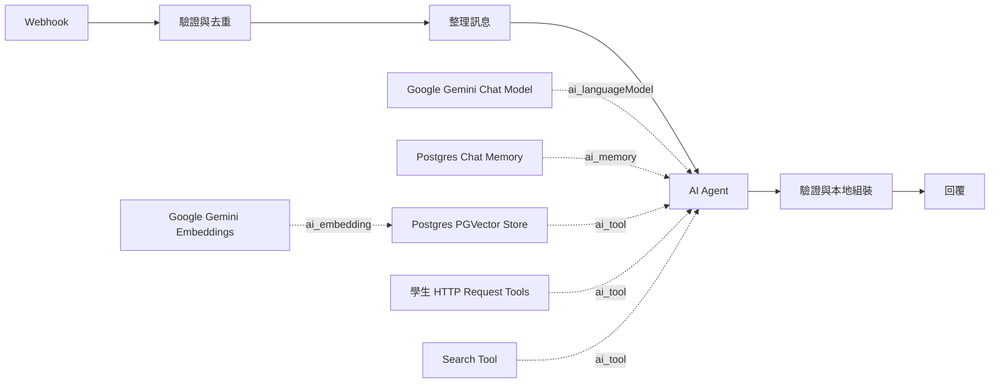

# 校園 n8n AI Agent 系統設計

版本：0.4；2026-10-06。依使用者的「My workflow」架構修訂。本文件描述目前採用的設計；實作與驗收狀態依 [Roadmap](ROADMAP.md)。

## 1. 目的與範圍

以 LINE 提供校園公開問答、本人課表、缺曠及學生公告。AI Agent 建立在 n8n，使用 Google Gemini、Postgres Chat Memory、PGVector 與直接連接的 HTTP Request／Search Tools。先在本機 Docker 驗證，穩定後才部署 Linux 遠端。

不保存學校密碼；不提供校務寫入、訂閱計費或年齡聲明流程。LINE、LIFF、校方登入、OCR、Brave、真實 Gemini 與知識庫語料仍分階段接通，不能把合成資料測試當作正式服務。

## 2. 系統責任

| 元件 | 責任 |
|---|---|
| n8n Webhook 與前置節點 | 接收內部事件、呼叫驗證／去重、整理模型輸入與 session key |
| n8n AI Agent | 理解問題、利用對話上下文、選擇工具、依公開證據產生答案 |
| Google Gemini Chat Model | AI Agent 的生成與工具選擇模型，直接連接 ai_languageModel |
| Postgres Chat Memory | 以 session key 保存對話，直接連接 ai_memory |
| Postgres PGVector Store | 以 retrieve-as-tool 模式直接連接 ai_tool，檢索公開知識 |
| Google Gemini Embeddings | 連接 PGVector 的 ai_embedding；文件與查詢用相同模型及維度 |
| 學生 HTTP Request Tools | 固定端點與操作，呼叫本人課表／缺曠／公告 API |
| Search Tool | HTTP Request Tool 呼叫受控搜尋介面；正式 adapter 使用 Brave 與官方原文 reader |
| Gateway／school-adapter | LINE 驗簽、身分與工具權限、登入／OCR／Cookie、個人資料處理及回覆發送 |
| 結果處理 | 驗證模型輸出、核對來源、本地組裝私人結果，再回覆 |

正常工具不包成 Call n8n Workflow Tool。子流程僅在未來確有可重用的多步驟流程時另行引入。舊 WF-01～07 與三個包裝工具是歷史測試資產，不是本版主流程。

## 3. 主流程與連線

重複事件直接回 duplicate，不再次呼叫 Agent。技術失敗與輸出不合法走固定錯誤回覆，不把 stack、token 或原始私人資料回傳。

本機內部 Webhook 等待結果後回 JSON；正式 LINE 必須先驗簽、持久接收並快速 ACK，再派送 n8n 任務，不能讓 LINE 等待整段模型運算。

## 4. 模型與記憶

Gemini credential 在 n8n 設定，不寫入 workflow JSON。生成模型沿用待驗證設定 `models/gemini-3.8-flash`，embedding 設定為 `models/gemini-embedding-001`；均須以使用者付費 project 做可用性、schema、維度與用量 smoke test，尚未宣稱可用。原生 node 使用其支援的供應商契約，不再採用舊設計的 Gateway Interactions API adapter。

Postgres Chat Memory 的 contextWindowLength=5。它限制提供給模型的上下文，不代表資料庫只保留五筆，也不自動刪除歷史。本機合成 session 為 `synthetic:demo-a`／`synthetic:demo-b`；正式 session key 必須由已驗證的使用者與會話推導，不能採用匿名請求任意指定的他人識別值。

正式目標：對話歷史保留最多七天，支援清除對話與解除綁定清理；定期清理與身分推導尚待 Phase 2 實作。對話內容可能送 Gemini 作上下文，資料處理告知需明示。關閉 n8n execution 原文保存不等於 Chat Memory 不保存。

## 5. 工具、資料與授權

### 公開資料

PGVector 儲存核定公開文件與來源 metadata。Search Tool 負責時效問題；搜尋摘要只能發現來源，正式答案須核對官方原文。工具取得的文字一律視為資料，不能改寫系統指令或擴大權限。具體匯入與檢索見 [RAG](RAG.md)。

### 個人資料

每項學生功能有獨立 HTTP Request Tool：student_schedule、student_absence、student_announcements。工具端點和 action 固定；taskId／capability／使用者身分從可信前置資料映射，不由模型填寫。學校帳密僅在 LIFF 登入請求交給 school-adapter，登入 Cookie 留在後端；本地 OCR 最多三輪／30秒，密碼錯誤立即停止，結果不明不盲目重送。

私人原文不提供給 Agent 或 Chat Memory。學生工具只回處理狀態，回覆階段本地組裝私人內容。公開答案與個人模板可合併顯示，但不將合併後私人文字寫回模型上下文。本人 session、資格、撤銷與結果所有權必須由後端驗證。

### 本機合成契約

`POST /internal/v1/agent/prepare`：嚴格接受 eventId、scenario（knowledge/web/personal/mixed）及 session（demo-a/demo-b），產生固定測試 prompt、taskId、capability、sessionKey。拒絕額外欄位，不接收真實學生文字。

`POST /internal/v1/agent/tool`：接受 taskId、capability、kind、query。直接 HTTP 工具使用固定 personal 或 web；personal query 僅允許三個既定 action。回傳合成資料或處理狀態。knowledge 舊分支只供舊回歸測試，新主流程直接查 PGVector。

`POST /internal/v1/agent/complete`：接受模型 JSON 字串 `{answer, sourceIds}`，拒絕非法形狀、未知引用與無依據回答，本地合併私人模板。PGVector 尚未匯入文件；其來源登錄／任務證據對接尚未實作，不能直接將任意 vector sourceId 當作已通過驗證。

上述端點使用 service credential；capability 綁定任務與90秒期限。去重與任務目前在單程序記憶體，重啟會清除，正式 transaction inbox/outbox 尚未建置。

## 6. 預算與錯誤

Agent maxIterations=5；Gateway 的 HTTP 工具每任務最多4次；主流程 timeout=90秒。直接 PGVector 與模型呼叫不經 Gateway，不能宣稱這四次限制涵蓋所有工具，更不能把 maxIterations 當成供應商 HTTP attempts 或費用硬上限。

正式上線前須加入涵蓋 Gemini、embedding、搜尋的共用用量計量與費用預留、錯誤重試限制、並發限制及 deadline 檢查。沒有來源時拒答／追問；模型回覆格式或引用不合法時走失敗出口。來源 ID 存在不代表語意有支持，另以 QA 集驗收。

## 7. 部署與儲存

本機 Compose：n8n、PostgreSQL/pgvector、mock Gateway、只綁 loopback 的管理 proxy。n8n metadata 與 Agent 資料使用不同 database／role。`campus_agent` DB 具有 `agent_chat_histories`、`campus_documents`，不與 n8n credential tables 混用。

預設 internal network 不外連。操作者補上 Gemini credentials 後，才套用 `infra/compose.agent-online.yaml`；這會讓 n8n 可以連外，不代表具備供應商域名 allowlist。真實資料前須驗證網路與資料處理邊界。遠端主機保持延後部署。

## 8. 驗收與後續

- 結構：原生 Agent、model、memory、vector、embedding 與直接 HTTP 工具型別、版本與接線正確；主流程沒有 toolWorkflow。
- 本機：資料庫可用、memory session 隔離、HTTP 權限／期限／去重與輸出驗證，實際 n8n 匯入與畫布。
- 外部待驗證：Gemini 工具選擇、多輪上下文、真實 embedding／PGVector 檢索、Brave 官方來源、LINE 回覆及學校登入。
- 正式驗收：兩位學生隔離、撤銷／重新登入、OCR 失敗、偽造身分、重送不重複回覆、source injection、過期來源、費用到頂、備份／復原、重啟與負載測試。

[工作流規格](WORKFLOWS.md) · [RAG](RAG.md) · [Roadmap](ROADMAP.md) · [操作說明](NATIVE-AGENT.md)
