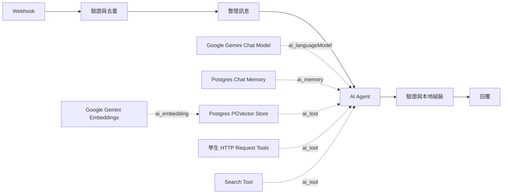

# 校園 n8n AI Agent 系統設計

版本：0.5；2026-10-06。依使用者的「My workflow」原生節點架構修訂，區分正式實作與歷史合成流程；實作與驗收狀態依 [Roadmap](ROADMAP.md)。

## 1. 目的與範圍

以 LINE 提供校園公開問答、本人課表、缺曠及學生公告。AI Agent 建立在 n8n，使用 Google Gemini、Postgres Chat Memory、PGVector 與直接連接的 HTTP Request／Search Tools。先在本機 Docker 驗證，穩定後才部署 Linux 遠端。

不保存學校密碼；不提供校務寫入、訂閱計費或年齡聲明流程。LINE、LIFF、校方登入、OCR、Brave、真實 Gemini 與知識庫語料仍分階段接通，不能把合成資料測試當作正式服務。

### 學校與既有程式基線

目標學校為 **國立臺中科技大學**；校務登入入口為 `https://sso.nutc.edu.tw/eportal/default.aspx`。
既有程式位於 `/Volumes/KINGSTON/yuzen/code/nutc_student_system`，原 SDD 檢視基線為 `b2e4d4fd033e284334d8ea055f9a6fe31dcfb8cc`。本節補回精簡 v0.4 時遺漏的學校資訊，依本專案 `4c5e10e:docs/SDD.md`，實際移植仍重新檢查現行原始碼。

- 登入協定：`backend/src/modules/auth/auth.service.ts`、`backend/src/utils/nutc-session.ts`、`backend/src/utils/ocr.ts`。ASP.NET ViewState／captcha／CookieJar；本地 `ddddocr-node`，驗證碼五字元，最多三輪且總計 30 秒。只有明確驗證碼錯誤可重試；密碼錯誤、鎖定或結果不明即停止。
- 課表、缺曠、公告：`backend/src/modules/school/{schedule,absence,announcement}/` 的 service／parse。既有 `/api/v1/auth/login`、`/school/schedule`、`/school/absence?semester=1131`、`/school/announcement` 是程式介面參考，不代表已部署可呼叫的校方 API。
- 不沿用既有 Redis 密碼保存、自動重新登入、背景 warmup 或他人 session。新 adapter 使用獨立隨機 session，密碼僅用於當次登入且不 trim。session 最長八小時、閒置三十分鐘；同使用者／帳號禁止並行登入；只有校方明確拒絕帳密才計入十五分鐘兩次保護，OCR／連線／解析失敗不計入。
- 一個學號只綁一個 LINE 身分；解除綁定撤銷 session 與尚未交付的私人結果。LIFF ID token 由後端驗證，再簽發 Secure／HttpOnly／SameSite=Lax session；敏感操作檢查 Origin 及 CSRF。
- 初始公開來源網域：`www.nutc.edu.tw`、`aca.nutc.edu.tw`、`student.nutc.edu.tw`、`elib.nutc.edu.tw`。PGVector／官方 reader 路徑只有核定、取得原文並登錄的來源可作答案證據；Google Search Grounding 使用獨立的本人結果頁，不能冒充已核定的 RAG 原文證據。

2026-10-06 使用者提供 Messaging Channel `2011885580`、Login Channel `2011885607`、LIFF `2011885607-MccunYXG`；公開 HTTPS 為 `https://nutc-agent.yuzen.dev`，透過 Cloudflare Tunnel 接本機受限 ingress。LINE／Gemini 秘密已存根目錄 `.env`，不存 `.local`。LIFF endpoint 為 `/liff/`；採 LIFF SDK 登入，未實作獨立 LINE Login callback 路由。使用者指定先限本人試用，尚待其 LINE User ID 與自行完成校務登入。付費測試授權為 **新臺幣 100 元總額內**，不是每日或每個供應商各 100 元。正式接通進度以 [Phase 2–5 追蹤](PHASE-2-5-IMPLEMENTATION.md) 為準。

## 2. 系統責任

| 元件 | 責任 |
|---|---|
| n8n Webhook 與前置節點 | 接收內部事件、呼叫驗證／去重、整理模型輸入與 session key |
| n8n AI Agent | 理解問題、利用對話上下文、選擇工具、依公開證據產生答案 |
| Google Gemini Chat Model | AI Agent 的生成與工具選擇模型，直接連接 ai_languageModel |
| Postgres Chat Memory | 以 session key 保存對話，直接連接 ai_memory |
| Postgres PGVector Store | 以 retrieve-as-tool 模式直接連接 ai_tool，檢索公開知識 |
| Google Gemini Embeddings | 連接 PGVector 的 ai_embedding；文件與查詢用相同模型及維度 |
| 學生 HTTP Request Tools | 固定端點與操作，呼叫本人課表／缺曠／公告 API |
| Search Tool | HTTP Request Tool 呼叫受控搜尋介面；已實作 Brave／官方 reader，但未接真實搜尋。Google Search 替代方向待定，其 grounding 不能直接當網址爬取服務 |
| Gateway／school-adapter | LINE 驗簽、身分與工具權限、登入／OCR／Cookie、個人資料處理及回覆發送 |
| 結果處理 | 驗證模型輸出、核對來源、本地組裝私人結果，再回覆 |

正常工具不包成 Call n8n Workflow Tool。子流程僅在未來確有可重用的多步驟流程時另行引入。舊 WF-01～07 與三個包裝工具是歷史測試資產，不是本版主流程。

## 3. 主流程與連線

重複事件直接回 duplicate，不再次呼叫 Agent。技術失敗與輸出不合法走固定錯誤回覆，不把 stack、token 或原始私人資料回傳。

本機內部 Webhook 等待結果後回 JSON；正式 LINE 必須先驗簽、持久接收並快速 ACK，再派送 n8n 任務，不能讓 LINE 等待整段模型運算。

## 4. 模型與記憶

生成模型為 `models/gemini-3.8-flash`，embedding 為 `models/gemini-embedding-001`／3072維；真實API及原生節點已完成smoke與部分公開QA。原始key只由Gateway讀取 `.env`；n8n credential持有內部proxy token及host，工作流JSON只保存credential參照。原生node經Gateway費用proxy轉送供應商契約，不採用舊設計的Interactions API adapter。可用性測試不代表所有問答與真人LINE整合已通過。

Postgres Chat Memory 的 contextWindowLength=5。它限制提供給模型的上下文，不代表資料庫只保留五筆，也不自動刪除歷史。本機合成 session 為 `synthetic:demo-a`／`synthetic:demo-b`；正式 session key 必須由已驗證的使用者與會話推導，不能採用匿名請求任意指定的他人識別值。

正式實作以已驗證LINE身分與generation推導session key，支援清除對話、解除綁定與七天清理。資料庫trigger限制原生Memory只能寫入仍有效的身分generation；清除／撤銷與派送共同鎖定身分。對話內容可能送Gemini作上下文，LIFF頁提供資料處理告知。關閉n8n execution原文保存不等於Chat Memory不保存；真人多輪驗收仍待完成。

## 5. 工具、資料與授權

### 公開資料

PGVector 儲存核定公開文件與來源 metadata。Search Tool 已接 Gemini 官方 Google Search，由 Gemini 搜尋並統整；完整答案、來源及 Search Suggestions 在受驗證的本人 LIFF 結果頁呈現。主 Agent 只收到完成狀態，grounding 內容不送入 crawler、共享 RAG 或主 Agent Memory。Google 分支與官方 reader 證據路徑不同，付費實測尚待完成；詳見 [Google Search](GOOGLE-SEARCH.md)。工具取得的文字一律視為資料，不能改寫系統指令或擴大權限。具體匯入與檢索見 [RAG](RAG.md)。

### 個人資料

每項學生功能有獨立 HTTP Request Tool：student_schedule、student_absence、student_announcements。工具端點和 action 固定；taskId／capability／使用者身分從可信前置資料映射，不由模型填寫。學校帳密僅在 LIFF 登入請求交給 school-adapter，登入 Cookie 留在後端；本地 OCR 最多三輪／30秒，密碼錯誤立即停止，結果不明不盲目重送。

私人原文不提供給 Agent 或 Chat Memory。學生工具只回處理狀態，回覆階段本地組裝私人內容。公開答案與個人模板可合併顯示，但不將合併後私人文字寫回模型上下文。本人 session、資格、撤銷與結果所有權必須由後端驗證。

### 歷史本機合成契約

`POST /internal/v1/agent/prepare`：嚴格接受 eventId、scenario（knowledge/web/personal/mixed）及 session（demo-a/demo-b），產生固定測試 prompt、taskId、capability、sessionKey。拒絕額外欄位，不接收真實學生文字。

`POST /internal/v1/agent/tool`：接受 taskId、capability、kind、query。直接 HTTP 工具使用固定 personal 或 web；personal query 僅允許三個既定 action。回傳合成資料或處理狀態。knowledge 舊分支只供舊回歸測試，新主流程直接查 PGVector。

`POST /internal/v1/agent/complete`：合成gateway接受模型JSON字串 `{answer, sourceIds}`，拒絕非法形狀、未知引用與無依據回答，本地合併合成私人模板。以上僅適用 `apps/mock-gateway` 和歷史工作流，不得用它們宣稱正式資料驗收通過。

上述合成端點使用service credential及記憶體任務；正式 `apps/gateway` 為獨立實作，不把外部連線加進mock gateway。

### 正式持久契約

LINE入口驗簽後以transaction寫入inbox／task並ACK，worker再派送具taskId／lease／capability的內部Webhook。prepare／tool／complete綁定身分generation、任務租約與一次prepare檢查點。capability只存hash；租約90秒、任務最長5分鐘；每位使用者同時只處理一個任務。

正式PGVector已有3份核定HTML／PDF、6段真實向量。completion由固定工作流轉交native observation，後端核對來源版本、chunkId及全文，綁定本次任務證據；完成與outbox派送時再次核對來源有效性。私人ref與outbox內容加密，派送前再檢查學校session。記憶中的sourceId不能冒充本次證據。

受邀名單由根目錄 `.env` 的 `INVITED_LINE_USER_IDS` 管理，管理腳本原子同步名單。移除資格會輪替generation、清除登入session／私人暫存／記憶並取消未交付工作；重新加入名單不自動解除使用者先前的撤銷狀態。

## 6. 預算與錯誤

Agent maxIterations=5；Gateway的HTTP工具每任務最多4次；主流程timeout=90秒。PGVector查詢直接使用資料庫，模型及embedding HTTP經費用proxy；四次HTTP工具限制不涵蓋全部原生工具，也不能把maxIterations當成費用硬上限。

Gemini、embedding及現有Brave adapter共用持久預算預留；每個供應商HTTP嘗試（含SDK重試）均先通過原子上限檢查，成功且用量可信時才保守結算。失敗或用量不明不退預留，不為驗收重置帳本。每日及累計上限目前均US$2；詳細模型價格與限制見 [供應商預算](PROVIDER-BUDGET.md)。沒有來源時拒答／追問；模型回覆格式或引用不合法時走失敗出口。來源ID存在不代表語意有支持，另以QA集驗收。

## 7. 部署與儲存

本機Compose包括固定n8n 2.41.7、PostgreSQL／pgvector、歷史mock gateway及loopback管理proxy；正式overlay另部署gateway與school-adapter。n8n metadata與Agent資料使用不同database／role。`campus_agent`保存正式身分、inbox／task／outbox、學校與LIFF session、Memory、來源版本及知識庫staging／chunks，不與n8n credential tables混用。

合成基礎網路不外連；正式overlay已套用連外與provider設定。這不是Docker層供應商網域allowlist；官方reader及學校client各自執行固定host／DNS／redirect檢查。公開ingress只提供LIFF與LINE所需路徑，internal／provider路徑不對外代理。遠端Linux正式主機仍未部署；本機Docker VM不能視為正式主機。

## 8. 驗收與後續

- 結構：原生 Agent、model、memory、vector、embedding 與直接 HTTP 工具型別、版本與接線正確；主流程沒有 toolWorkflow。
- 本機：資料庫可用、memory session 隔離、HTTP 權限／期限／去重與輸出驗證，實際 n8n 匯入與畫布。
- 外部已有證據：真Gemini／embedding與原生PGVector、HTML／PDF匯入、官方LINE webhook驗證及匿名校方連線／Linux OCR格式測試；公開QA只完成部分，詳見逐題報告。
- 仍待驗證：完整公開QA、Google 官方搜尋付費實測與 LIFF 呈現、LINE實際回覆、本人校務登入及真實課表／缺曠／公告、多輪與混合回覆。
- 使用者指定目前只開放本人，雙真人隔離驗收延後；合成隔離、撤銷／重送／過期來源／費用到頂測試不能當作真人驗收。備份／復原、完整重啟負載及遠端部署仍屬未完成Phase6。

[工作流規格](WORKFLOWS.md) · [RAG](RAG.md) · [Roadmap](ROADMAP.md) · [操作說明](NATIVE-AGENT.md)
