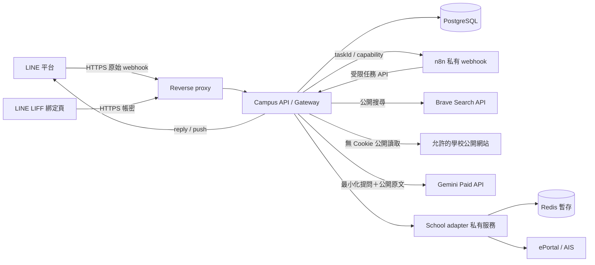
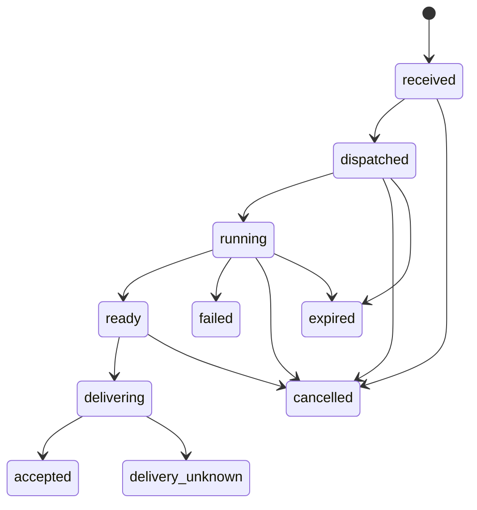

# 國立臺中科技大學 LINE 校園 Agent — 系統設計文件（Software Design Document, SDD）

版本：0.3（第一版納入校園知識庫與受控 Agentic RAG）  
研究日期：2026-10-05，Asia/Taipei  
專案：`/Volumes/KINGSTON/yuzen/code/n8n-agent`  
狀態：設計基線已建立；Phase 1 本機合成環境已部署並驗證，詳見 [本機驗收](verification/phase-1.md)。遠端交付延後；未使用真實學生帳號，也未呼叫付費 API。

## 1. 目標、範圍與決策狀態

### 1.1 已由需求方確認

- 使用 LINE Bot 作為主要操作介面，透過 webhook 連接本地部署的 n8n。
- 常駐主機為 Linux。
- 先提供自己與少量同學試用，第一版完成「校園問答＋個人查詢」。
- 雲端模型優先使用付費 Gemini API。
- 重用既有 `nutc_student_system` 的學校串接經驗與程式，第一版納入本地 OCR 驗證碼辨識。
- 不設年齡聲明、年齡欄位或人工年齡審核流程。
- 第一版納入精選公開知識庫 RAG＋官方即時搜尋，由受控 Agent 選擇來源並有限補查。
- 先設計節點工作流；部署後須以實際 n8n 網頁編輯器展示，並依 phase 交付。

### 1.2 本文件採用的設計決策

以下是本次研究形成的實作預設，不代表使用者已逐項確認：

| 項目 | 決策 | 理由 |
|---|---|---|
| 試用規模 | 5–20 位受邀者，最多 5 個同時處理中的任務 | 有界的容量與費用；不是已量測容量 |
| 個人功能 | 今日／明日／本週課表、當期／指定學期缺曠、學生系統公告 | 對應已存在的程式模組 |
| 帳密 | 專用 LIFF 網頁輸入；不保存密碼；登入逾期重新登入 | 第一版不需要長期背景追蹤 |
| 驗證碼 | 沿用既有 `ddddocr-node` 本地辨識模式 | 學生只輸入帳號與密碼；有界重試 |
| Agent | 有界的意圖辨識、資料檢索與答案整理 | 工具權限由後端執行，不讓模型任意操作校務系統 |
| 知識庫 | PostgreSQL＋pgvector、中文關鍵字檢索與向量檢索融合 | 精選公開規章；與即時搜尋互補，版本及來源可追溯 |
| 公開搜尋 | Brave Search Web API＋官方網頁讀取＋Gemini 摘要 | 保留 LINE 內回答體驗，避免 Google grounding 呈現限制 |
| 個人輸出 | 本地固定模板／Flex Message | 課表、缺曠與登入後公告不送雲端模型 |
| 部署 | Docker Compose，n8n regular mode、PostgreSQL、Redis、Node.js/TypeScript API | 試用規模不需要 Kubernetes 或 n8n 分散式 worker |
| 重用策略 | 新專案內建立精簡 school-adapter；從可追溯版本移植必要程式 | 不直接共用原 App 的帳號 Session 或背景工作 |

### 1.3 明確不做

第一版不做定時個人追蹤、公告訂閱、每日推播、請假送出、選課、寄信、成績分析、TronClass、群組查詢、語音／圖片提問、全校開放、全站爬取或長期對話記憶。回答當次問題所需的延遲推播不等於訂閱功能，仍屬第一版。

「可問學校任何事」代表可自由提問；回答能力受官方可取得資料限制。無資料、矛盾或無法判定適用對象時，明確說明或追問，不承諾全知。

## 2. 研究方法與現況

查核既有專案的 router、service、parser、Session、設定、測試結構及官方 LINE、n8n、Google、Brave、學校網站。僅進行公開資料讀取與本機原始碼檢查。

原專案基準 commit：`b2e4d4fd033e284334d8ea055f9a6fe31dcfb8cc`。當時 `backend/package.json` 有未提交修改；本次沒有修改它。README 稱前端尚未建立，與實際檔案不同，故以程式碼為準。原圖譜僅供導航，其日期與內容不能作為目前實作證明。

### 2.1 可重用能力

| 能力 | 既有 API（`/api/v1` 下） | 實際程式行為 | 本案使用方式 |
|---|---|---|---|
| 登入 | `POST /auth/login` | ASP.NET 表單、ViewState、驗證碼、CookieJar | 保留 CookieJar／隱藏欄位＋本地 OCR；調整 Session 隔離與生命週期 |
| JWT 更新 | `POST /auth/refresh` | 更新自家 JWT；不保證校方 Cookie 仍有效 | 新系統不以 JWT refresh 當成學校登入仍有效的證據 |
| 課表 | `GET /school/schedule` | 抓取 AIS HTML，回傳每週課程事件 | 保留 HTML 解析並增加結構／時段驗證 |
| 缺曠 | `GET /school/absence?semester=1131` | 解析 `tr.tr_data` 及 `oldtitle` 明細 | 保留原始意義，不能擅自把所有缺曠都算成曠課 |
| 公告 | `GET /school/announcement`、`GET /school/announcement/:bid` | 登入後 AIS 公告；列表與詳情分開 | 個人查詢工具；不得當成完整公開校園公告來源 |

詳見原始碼：[登入](/Volumes/KINGSTON/yuzen/code/nutc_student_system/backend/src/modules/auth/auth.service.ts)、[Session](/Volumes/KINGSTON/yuzen/code/nutc_student_system/backend/src/utils/nutc-session.ts)、[課表](/Volumes/KINGSTON/yuzen/code/nutc_student_system/backend/src/modules/school/schedule/schedule.service.ts)、[缺曠](/Volumes/KINGSTON/yuzen/code/nutc_student_system/backend/src/modules/school/absence/absence.service.ts)、[公告](/Volumes/KINGSTON/yuzen/code/nutc_student_system/backend/src/modules/school/announcement/announcement.service.ts)。

### 2.2 重用前必須調整

| 觀察 | 對本案的影響 | 必要處理 |
|---|---|---|
| Session ID 等於學校帳號；登入會刪掉該帳號的 Session | 同帳號多客戶端互相影響 | 使用隨機 Session ID；本案獨立 Redis；不碰原 App 狀態 |
| 密碼保留在記憶體，並加密存 Redis，供 silent relogin | 與本案「不存密碼」矛盾 | 移除本案的 `setPassword`、保存密碼與自動重登路徑 |
| Redis 建立時 TTL 7 天，本機 Map 命中不檢查期限 | Redis 過期不等於程序內資料失效 | 所有讀取都驗證絕對／閒置期限；取消無界 Map |
| 登入後預熱 AIS、Mail、TronClass | 超出第一版範圍 | 只建立 AIS；不啟用原 warmup worker |
| 登入錯誤直接 `console.error(error)` | HTTP 錯誤物件可能包含提交表單與 headers | 只記錄經允許的錯誤碼、HTTP 狀態與 requestId |
| 密碼 schema 使用 `.trim()` | 可能改變學生實際密碼 | 密碼不得 trim／normalize，只檢查長度上限與非空 |
| 學校請求未普遍設定 timeout | 查詢可能長時間懸掛 | 連線／整體 timeout，GET 有界重試，登入 POST 不自動重送 |
| 課表節次時間是硬編碼；不認得時段可產生 `00:00` | 可能誤報上課時間 | 未確認時段只顯示節次，不生成 00:00；核對學制時段表 |
| 解析器可能在 HTML 變動時回傳空陣列 | 「解析失敗」被誤認為「沒有課／沒有缺曠」 | 先驗證頁面特徵與明確空結果，再解析 |
| 路由測試 mock 掉 service | 不足以證明校方登入與 HTML 抓取仍有效 | 補去識別 HTML fixture 測試與真人同意的連線驗收 |
| 設定有可預測預設 secrets；express 在 devDependencies | 不可直接套用正式容器安裝流程 | 新服務缺 secret 即拒啟動；runtime dependencies 正確分類 |

這是與重用範圍相關的設計檢查，不是完整安全稽核，也未執行既有專案 build／tests。

## 3. 外部條件與選型結論

### 3.1 Gemini

採付費 Google Cloud project 的 Gemini API，主模型以 `gemini-3.8-flash` 為設計基準，確切呼叫契約與價格快照見 [Gemini 研究附件](research/gemini.md)。不使用 `latest` 別名；API adapter 封裝模型名稱，部署前以該 project 做可用性與 schema smoke test。

產品依需求方所述，供其本人與少量大學同學試用；不設年齡聲明、生日蒐集或人工年齡審核。供應商適用條件僅保留於研究附件，產品流程不將「大學生」當成已執行年齡驗證的證據。

付費服務的 prompts／responses 不用於改善 Google 產品，但仍可能為服務安全目的有限保存；本地 n8n 不代表模型輸入留在本地。告知頁要說明會傳送經最小化處理的提問與公開來源文字，避免蒐集不必要個資。[G1]

### 3.2 為何第一版不用 Gemini Google Search grounding

Grounding 回答與 Search Suggestions 有同時呈現、修改與再利用限制。LINE 的純文字／Flex 無法直接等同官方網頁 widget；不能刪掉建議區塊後假設合規，也不能把 grounding links 拿來當自建爬蟲的發現來源。[G1][G2]

本版採 Brave 搜尋結果發現 URL，自家 reader 讀取允許的官方頁面，再請 Gemini 依提供的原文整理。這仍具備「自己上網查詢」能力。額外需要 `BRAVE_SEARCH_API_KEY`；未取得時只提供固定官方入口與個人查詢，不假裝已搜尋。

### 3.3 n8n 與 LINE

- 官方 GitHub 在研究日回傳 latest non-prerelease 為 `n8n@2.41.7`。這是候選 pin，不代表已在本機驗證；部署時固定 tag＋digest並記錄實際匯入的 node typeVersion。[N1]
- 新版官方設定使用 `N8N_WEBHOOK_URL`；文件標示舊 `WEBHOOK_URL` 自 2.35.0 起 deprecated。代理層數必須依實際拓樸設定。[N2]
- LINE Messaging API channel 與 LIFF 所在 LINE Login channel 建在**同一 provider**，才能以一致的 LINE user ID 綁定。[L1]
- Webhook 先對原始 bytes 驗簽，再解析 JSON；官方要求先驗證，且建議非同步處理。用 `webhookEventId` 去重。[L2][L3]
- reply token 單次使用且時限短；用本案 40 秒的內部截止時間保留餘裕，不能承諾可用到最後一秒。[L4]
- push 計入方案用量，reply 不計入該訊息數。實際台灣方案與可用額度以上線帳號為準。[L5]

## 4. 系統架構與信任邊界



### 4.1 責任分工

| 元件 | 職責 | 不得持有／執行 |
|---|---|---|
| Reverse proxy | TLS、路徑路由、body 大小限制 | 不記錄登入 body、token query |
| Campus API | LINE 驗簽、邀請名單、綁定、任務狀態、Gemini／搜尋 adapter、權限、呈現、送出 | 不永久保存密碼；不提供任意代理 URL |
| n8n | plan→分支→資料工具→delivery 的流程編排，錯誤流程、維護排程 | 不接收學校密碼、Cookie、LINE token、個人查詢完整內容 |
| School adapter | challenge、校方登入、Cookie、HTML 解析、個人查詢 | 不存密碼、不接觸 Gemini、不提供寫入校務系統功能 |
| PostgreSQL | 綁定、任務／outbox、同意、用量 | 不放學校 Cookie 或密碼 |
| Redis | 加密 school session、短期查詢結果、互斥鎖 | 不啟用持久化／備份；重啟後需重新登入 |

這裡的 n8n 是後端流程中心；補充 API 是有狀態且需要可靠權限的邊界。第一版不把每個模組拆成微服務：Campus API 一個程序，school-adapter 一個程序即可；兩者可同一 repo、獨立容器。

### 4.2 n8n 資料最小化

Gateway 保存已驗證的 requester context。n8n 只取得 `taskId`、短期 `taskCapability`、`requestId`、`deadlineAt`，以及 plan 的 `intent`／非敏感參數。個人查詢回傳 `resultRef`，完整資料留在 Gateway 可存取的短期加密快取，最後由 Gateway render＋send。

Capability 是隨機 256-bit bearer，資料庫只存 hash，綁定 task、允許動作、期限及綁定版本；只在 HTTPS／內部網路傳送，最長 180 秒，完成或取消即撤銷。不因 n8n 帶了其他 `userId`／`account` 就改變權限。每個內部呼叫還需 n8n 專用 service credential；所有內部路徑不由公開 proxy 暴露。

## 5. 使用流程

### 5.1 初次使用與綁定

1. 操作者為少量試用同學建立一次性邀請或 LINE allowlist；用途是控制試用規模，不作年齡審核。
2. 學生加入 Bot，透過 LIFF 接受資料處理說明並兌換邀請。未受邀者只看到服務說明，不能呼叫 Gemini／學校工具。
3. LIFF 用 `openid` 取得 LINE ID token，交由 Gateway 驗證 `client_id`、issuer、有效期與 subject，不相信前端自行送的 userId。[L6]
4. 建立 HttpOnly、Secure、SameSite=Lax Web session；變更操作檢查 Origin＋CSRF token。使用的 LINE 登入流程如有 nonce，驗證對應 nonce。
5. 學生在 LIFF 輸入學校帳號與原樣密碼。Gateway 將本次登入交給 school-adapter；帳密不經 n8n／Gemini。
6. Adapter 建立獨立 CookieJar，GET 登入表單與驗證碼，使用 `ddddocr-node` 辨識，將辨識結果與隱藏欄位一起 POST 學校。
7. 只在明確驗證碼錯誤時取新圖片、更新隱藏欄位並有界重試；帳密錯誤、鎖定或未知結果立刻停止，細節見 §5.2。
8. 確認登入成功並建立 AIS Session 後，交易式綁定 LINE member 與 school account HMAC。一人一帳號、一帳號一位 LINE 使用者；衝突時不透露對方身分。
9. 結束本次請求時丟棄密碼、驗證碼圖片／辨識文字與暫存 challenge；回傳狀態與遮罩帳號，不回傳學校 Cookie／JWT。

登入頁需明示此為非校方官方試用服務、帳密由本服務轉交學校、保存什麼資料、雲端模型處理範圍、解除綁定方式。LIFF 不因在 LINE 裡就變成學校官方 SSO 授權。

### 5.2 登入期限與錯誤

- 本案上限：登入狀態絕對期限 8 小時、閒置 30 分鐘；這是本案政策，不是學校保證。學校可能提早失效。
- 私有查詢遇到學校登入頁，標記 `reauth_required`，清除 session／私有快取，提示重新登入；不保存密碼進行 silent relogin。
- 自家 Web session 與學校 Session 不同。LINE 身分已確認，不代表學校登入仍有效。
- 登入 POST 不做 transport 自動重送。只有校方明確回覆驗證碼錯誤才啟動下一 OCR 輪；帳密錯誤／鎖定立刻停止，不確定上次是否送達時提示稍後重新操作。
- 比照原程式單次登入最多 3 個 OCR 輪次，每輪最多一次學校 POST，無論辨識長度錯誤或已提交均消耗一輪；30 秒為整體期限。每使用者／帳號每 30 分鐘最多 2 個登入請求，另設 IP 限速與單帳號 single-flight。學校回覆帳密錯誤即禁止本次後續輪次，校方鎖定提醒仍需處理。[U2]
- 未知畫面、MFA／額外驗證、學校維護或驗證碼服務異常均回明確錯誤，不自行越過。


### 5.2.1 OCR 重用規格

- 來源為 `backend/src/utils/ocr.ts` 與 `modules/auth/auth.service.ts`；使用 `DdddOcr.classification(image)`，不將驗證碼交給 Gemini。
- 既有程式雖建立 `sharp` 預處理 buffer，實際送進 OCR 的仍是原始 image。第一版以實際原圖辨識行為為基線，不宣稱預處理已有效；移植時不保留未使用運算。
- 辨識 trim 後長度不符原程式的 5 字元條件，不提交帳密，進下一輪；圖片、OCR 文字與表單隱藏欄位均不寫日誌。
- 每輪沿用本次登入 CookieJar，重新取得驗證碼，從校方回應更新 ViewState／EventValidation。未知頁面不得當作驗證碼錯誤重試。
- 原始 `isCaptchaError` 包含廣泛的「驗證碼」字樣，本案須以可識別的錯誤區塊／訊息解析，避免登入表單正常標籤造成誤判；帳密／鎖定判斷優先。
- OCR 全部失敗顯示「自動辨識失敗，請稍後重新登入」；第一版不自動切換成學生手輸驗證碼。
- Linux CPU 架構、native dependency、模型資產及離線 runtime 需在實際容器驗證；不把 macOS 原專案可載入視為 Linux 已可用。
- 密碼只在本次登入函式／HTTP 請求生命週期存在，不放 queue、DB 或 Redis，不保留供登入逾期後重試。

### 5.3 問答與個人查詢

Rich menu：`問學校`、`今日課表`、`明日課表`、`我的缺曠`、`學生公告`、`帳號設定`。

- 快捷選單走確定性意圖，不需要模型。
- 自由文字先本地檢查敏感內容、長度與指令，再使用 Gemini 結構化辨識意圖。禁止將聊天當成登入管道。
- 若偵測到帳密／token 類內容，丟棄內容並提示使用綁定頁，不傳模型；過濾無法保證找出所有自行輸入的個資，因此告知學生不要在聊天貼個資。
- 未綁定也可問公開資訊。個人查詢一律要求有效 binding＋school session。
- 群組與多人聊天室第一版忽略，不啟動模型／學校查詢。
- 混合問題（如「我明天第一堂課在哪，圖書館幾點開？」）最多拆為一個個人查詢及一個公開問題，各自處理後本地合併。查詢結果不回填 Gemini。
- 第一版各次提問獨立。只保留最長 5 分鐘、限定欄位的待澄清狀態（日期／學期／學制）；不把歷史對話整段送模型。

### 5.4 解除綁定與停用

在 LIFF 帳號設定明確操作解除綁定：先撤銷 binding version／pending capabilities，再刪 school session、私有快取與尚未送出的私有結果。送出端再次檢查版本，防止解除後收到排隊資料。

LINE `unfollow`：立即 suspend 使用者並取消 pending 任務、刪除 school session。重新 follow 不會自動恢復私人登入，須重新登入與確認。`unsend`：按 messageId 取消未完成任務並刪除相關內容；保留必要且不含內容的去重／用量紀錄。[L3]

## 6. 任務與 LINE 回覆可靠性

### 6.1 接收

Webhook `POST /api/v1/line/webhook` 必須在一般 `express.json()` 前處理 raw body。以 channel secret 計算 HMAC-SHA256/base64，固定時間比較；驗簽後才解 JSON。支援空 `events: []` 的 LINE Verify 請求，多事件逐筆處理。[L2]

驗簽後、寫入資料庫前，先進行本地敏感輸入攔截。被判為帳密／token 的訊息只建立「請使用綁定頁」提示任務，`encrypted_input=null`；原文不進 PG、Redis、n8n 或 log。驗簽前的原始 bytes 只存在本次請求記憶體，不寫檔。一般輸入也先最小化，再保存任務所需文字。

在 PostgreSQL 同一 transaction 建立 `line_events` 與 `tasks`。commit 後才回 200；資料庫不能寫入則回 503 讓 LINE 有機會重送。重複 event 回 200，不重建任務。收到群組／不支援型別事件可成功 ACK，但不啟動昂貴工作。

Dispatcher 以 DB lease 提取待派任務，呼叫 n8n production webhook。n8n「接受啟動」不代表完成，因此必須由任務狀態監看回收停滯工作。

### 6.2 執行狀態



`accepted` 指 LINE 接受 API 請求，不宣稱學生已讀或實際收件。每個 action 記錄 `(taskId, operationId, stage, iteration)` 和 cached outcome；iteration 由 Gateway 配給，n8n 重試不能造成重複送出。耗時中的 action 有 lease／fencing token；過期 worker 不可提交結果。每位使用者最多一個執行中、兩個排隊任務；超量回「請稍候」。不保證 LINE 網路事件嚴格原始順序，待澄清狀態按最新版本更新。

### 6.3 Reply／Push 決策

1. 回覆 ready 時，若收到 webhook 尚未超過 40 秒且 reply 尚未使用，使用 reply。
2. 超過 40 秒仍處理中，可嘗試用 reply 回一次「查詢中，完成後回覆」；最後答案採 push。計時器與一般 delivery 以 DB compare-and-set 決定誰取得 reply 權，不能兩邊同時使用。
3. 若 reply 回應 timeout、連線中斷而接受與否不明，標記 `delivery_unknown`；不直接再用 push 重送同一份最終答案，避免重複。學生可重新詢問。確定失敗才依錯誤分類決定是否改 push。
4. push 在第一次送出前生成並持久化 UUID `X-Line-Retry-Key`，重試使用相同 recipient／body／key；只對支援的 push API 使用，不用於 reply。接受過的 409 視為已接受；一般 4xx 不盲目重試。[L7]
5. 任務總期限 90 秒。過期後取消未完成步驟，回可重試提示；不稍後送出陳舊私人資料。
6. 每次送出前驗證成員仍啟用、binding version 未變、結果屬於該 task、內容時效有效；recipient 從 DB 取得，不接受模型指定。

初版每個答案最多 3 個 LINE message objects，文字每段目標不超過 1,500 字；Flex 有純文字 fallback。不要把 Markdown 表格直接當 LINE UI。長課表使用分頁按鈕，postback 由伺服器簽章或短期 opaque handle 表示，仍重新驗證本人。

## 7. 公開資訊檢索設計

### 7.1 來源

| 來源 | 用途 | 本輪證據 |
|---|---|---|
| `www.nutc.edu.tw` | 全校公告、行政與系所導覽 | 已讀取官網 |
| `aca.nutc.edu.tw` | 教務、選課、學籍與時程 | 已讀取 |
| `student.nutc.edu.tw` | 學務與學生相關資訊 | 已讀取 |
| `elib.nutc.edu.tw` | 圖書館 | 官網連結與頁面已確認；不是猜測的 library 子網域 |
| `nd.nutc.edu.tw`、`cc.nutc.edu.tw` 等 | 進修部、電算中心 | 官網提供連結；各頁解析待實作驗證 |
| `sso.nutc.edu.tw`、`ais.nutc.edu.tw` | 私人登入與資料 | 不納入公開 reader／搜尋內容來源 |

受控 registry 逐一登錄允許 host／path／用途。可新增從學校官網驗證的系所 host；不得自動把整個 `*.nutc.edu.tw` 都視為可讀的公開內容。[U1][U3][U4][U5]

### 7.2 即時搜尋路徑

整體採受控 Agentic RAG，詳見 [RAG.md](RAG.md)。plan 選擇 `knowledge`／`web`／`both`；知識庫與網頁證據使用同一引用契約。時效問題強制包含 web；缺少適用條件先追問。以下為 web 路徑，非每題必跑。

1. 本地隱私檢查；產生只含公開問題、日期、學制／校區（學生有提供時）的搜尋 query。
2. Brave Search `GET https://api.search.brave.com/res/v1/web/search`，`X-Subscription-Token` header。預設 `q=site:nutc.edu.tw ...`、`count=5`、`result_filter=web`、`text_decorations=false`；query 字数由本地限制在供應商上限內。[B1]
3. 若結果不足，由證據評估提出一次補查（見 §8.3），Gateway 核定 query 與來源；全任務最多兩次 web search。搜尋 query 中不得帶 LINE ID、學號、Cookie、token 或私人查詢結果。
4. 對結果做 URL／host registry 檢查，整個任務最多讀取 3 份官方文件；已登錄的官方公告列表也計入此上限。無結果不自動擴大到論壇當權威。
5. Reader 使用獨立、無 Cookie HTTP client，清除 HTML script/style/navigation，保留標題、日期、段落與表格文字。保留來源 URL 和擷取時間。
6. 文字 PDF 可在本機解析（最多 5 MB／30 頁）；掃描 PDF 初版標記不能完整讀取，附原文連結，不用片段推論全文。遇到真正的 JS-only 頁面回無法讀取，不引入無界瀏覽器操作。
7. 將原文段落分配 `sourceId`、`passageId`，總輸入預算 16k tokens；超過按相關度截取並標示不完整。私有內容不會走此步。
8. Gemini 只依給定證據生成結構化 answer。每項主張回傳 sourceId／passageId；伺服器檢查引用存在，URL 由資料表映射，不接受模型自行編造 URL。
9. 對 deadline、資格、數字與日期核對原文；有衝突則並列來源和日期，不強選一個。沒有足夠證據時回「尚無法確認」。
10. LINE 回覆簡短答案＋1–3 個官方來源＋資料日期／查詢時間；來源不足時輸出失敗原因與官方入口。

只驗證引用 ID 不足以證明主張正確；驗收仍需要人工判讀「來源是否支持答案」，見 §15。

### 7.3 Reader 邊界

只允許 HTTPS／443；拒絕 URL userinfo、IP literal、localhost、private/link-local IPv4/IPv6、雲端 metadata 位址。DNS 解析及每次 redirect 都重新驗證，連線綁定已驗證 IP 以避免 DNS rebinding。禁止轉發 Authorization／Cookie；最多 3 次 redirect、10 秒單頁 timeout、HTML 2 MB、壓縮解壓大小上限。校方登入 adapter 的網路 client 與 reader 不共用。

使用具聯絡方式的 User-Agent，尊重 robots 與頁面使用條件；每 host 同時最多 1 個請求，間隔初始 1 秒。遇 403、429、登入要求、驗證碼即停止，不繞過限制。第三方搜尋給的 URL 不等於取得網站內容授權。

搜尋 API 結果先只做當次處理，不持久化完整 results／snippets、不建搜尋索引；需快取或儲存時先確認所用 Brave 方案的 storage rights。官方頁面自行取得的內容仍依該網站條件處理。來源引用及結果暫存也需納入上線方案條款確認，不能把「只存部分」視為無限制。[B2]

## 8. Gemini 與工具契約

模型 integration 放在 Campus API，不依賴 n8n 內建 Gemini node 是否已支援新模型／欄位。n8n 呼叫受控 internal API 即可。供應商 SDK／REST 經單一 `gemini.client.ts` 封裝，固定版本、timeout、token 上限及錯誤映射。

選定 **REST Interactions API**：`POST https://generativelanguage.googleapis.com/v1beta/interactions`，以 `x-goog-api-key` header 認證。雖路徑仍為 v1beta，官方 overview 已將 API 標示 GA；`generateContent` 仍支援，但不混用兩者 schema。固定 `store:false, background:false, stream:false, service_tier:'standard'`；不用 `previous_interaction_id`，不用 tools。模型輸出格式透過 `response_format:{type:'text',mime_type:'application/json',schema:...}` 指定。`store:false` 關閉可供後續取回的 interaction 保存，不等於供應商完全不留安全紀錄。[G3][G4]

實作參數初值：`generation_config:{max_output_tokens:4096,thinking_level:'low',thinking_summaries:'none'}`，plan 可採更小輸出上限但需測量是否截斷；本地單呼叫 timeout 25 秒、全站 Gemini 同時 2 個請求。只有完成且可解析的 JSON 能進入後續流程。SDK 若採 `@google/genai`，官方列最低 2.3.0，實作時 pin 實際測試版本。[G3][G4]

REST 回應解析：只接受 `status='completed'`，從 `steps` 中最後一個 `type='model_output'` 的 `content` 取 `type='text'` 的文字，依序組合後 parse／驗 schema；沒有文字即失敗。SDK 的 `output_text` 是便捷欄位，不假設 REST wire 也提供它。`incomplete` 視為截斷，`requires_action` 視為本案無工具契約異常，`failed/cancelled` 或空內容都不可當答案；不拿截斷 JSON 直接發送或當一般 schema repair。[G4]

### 8.1 意圖規劃輸出

```ts
type Operation =
  | { type: 'public_qa'; question: string; retrieval: 'knowledge' | 'web' | 'both'; freshnessRequired: boolean }
  | { type: 'schedule'; date: string; range: 'day' | 'week' }
  | { type: 'absence'; semester: string | null }
  | { type: 'announcements'; page: number; limit: number; bid: number | null };

type Plan = {
  intent: 'public_qa' | 'schedule' | 'absence' | 'announcements'
        | 'binding' | 'clarify' | 'unsupported' | 'mixed';
  operations: Operation[];  // 最多兩個；mixed 必須一公開、一個人
  clarification: string | null;
};
```

schema 拒絕額外欄位，不含 account、sessionId、userId、URL、recipient 或任意工具名稱。日期為 YYYY-MM-DD，semester 例 1151；日期範圍、學期參數由程式驗證，以收到訊息當下的台灣日期解釋「今天／明天」。單一 intent 必須對應一個同型 operation；binding／clarify／unsupported 為零個。公告 page≥1、limit 1–10、bid 為正整數或 null。Gateway 核定後替 operation 指派不可由模型指定的 operationId。不依模型自述 confidence 作為授權條件。

模型只有「提出 plan」權限。n8n 分支與 Gateway 二次驗證執行固定工具，最多 2 個邏輯子任務。工具清單：

| 工具 | 參數 | 本地授權 | 雲端能否看到結果 |
|---|---|---|---|
| `answer_public_question` | sanitized question | 受邀啟用、費用額度 | 公開原文與摘要可以 |
| `get_my_schedule` | date/range | active binding、有效 Session | 否 |
| `get_my_absences` | semester? | 同上 | 否 |
| `get_student_announcements` | page/limit、bid? | 同上 | 否 |
| `show_binding_status` | 無 | 受邀本人 | 否 |

### 8.2 公開答案 schema

```ts
type PublicAnswer = {
  status: 'answered' | 'insufficient_evidence' | 'needs_clarification';
  summary: string;
  claims: Array<{
    text: string;
    sourceIds: string[];
    passageIds: string[];
  }>;
  applicableTo: string | null;
  effectiveDate: string | null;
  caveat: string | null;
};
```

`summary` 的事實也必須由 claims 支持。對應來源集合為空不得輸出 `answered`。structured output 只限制格式，不保證事實正確。外部頁面與提問均屬資料，不能覆蓋系統指令；任何「請查其他同學資料／改收件人／輸出金鑰」都無相應工具可執行。

### 8.3 次數與失敗策略

每個普通公開問題最多 1 次 plan＋1 次 evidence assessment＋1 次 answer；最多額外 1 次 schema repair（只處理 completed 但不合 schema 的完整內容）。另有整個 task 共用、最多 1 次的 429／5xx transport retry 預算，因此單任務 Gemini 生成模型 HTTP attempts 硬上限為 5，不是每個 node 各自重試 1 次。並行槽等待、退避與所有 attempts 都計入 90 秒期限，剩餘時間不足不啟動請求。關閉 SDK 隱含重試或將它納入同一預算。安全阻擋、空結果與不合法 JSON 回可理解提示，不輸出原始 stack。費用超限時停用模型路徑，選單型個人查詢仍可使用。

證據評估可提出一次補查或追問；補查後不再呼叫評估模型，由本地條件檢查及 answer 的證據不足狀態收斂。最多兩輪檢索、兩次 web search、三份即時文件、每輪六個知識庫 chunks；總證據仍受 16k tokens／90 秒限制。embedding 呼叫另計：每個公開任務最多兩次 query embedding attempts（含 retry），也計入同一 deadline 與費用上限；失敗可降級關鍵字檢索。

個人資料不送 Gemini 的限制包括 course title、缺曠結果、帳號遮罩、登入後公告原文；不能先刪名字就把完整私人結果回填模型。自由提問可能含學生自行輸入的個資，需告知並做最小化，不能聲稱完美匿名化。

## 9. 個人資料正規化

### 9.1 課表

既有 parser 輸出 `weekday, periods, startTime, endTime, title, teacher, className, classroom`，是每週規律，**不是已確認某日一定上課的行事曆**。

新回應：`semester?`, `timezone`, `scheduleKind: 'weekly'`, `fetchedAt`, `items[]`, `warnings[]`。item 增加 `timeVerified`；無法確認節次時 start/end 為 null。按日期查詢只能映射星期幾，回覆註明「依本學期週課表；停課、補課或臨時調整請依公告」。學期間／寒暑假／特殊週別未能確認時，不宣稱當天一定有課。

來源未提供可靠學期資訊時 `semester=null`，不得從系統日期硬猜。不同學制的節次映射要分開確認。教室缺漏顯示「未提供」，不是生成地點。

### 9.2 缺曠

既有 `absence` 與 `absenceDetail` 是文字。新回應保留 `summaryText`、`detailText[]`、`semester`、`courseName`、`fetchedAt`。沒有驗證可靠的明細 grammar 前，不生成「總曠課節數」或處分判斷。

`semester` 接受校務代碼，例如 `1151`；未指定使用來源頁目前選項，顯示該來源學期。明確空結果與解析失敗分開。課程名稱等依原文呈現，不由模型潤飾。

### 9.3 登入後公告

清單保留 `bid`、標題、發布單位、分類；日期需從詳情確認，不以抓取時間當發布時間。第一版詳情轉純文字，移除 script／事件屬性，不將上游 HTML 直接注入 LIFF。附件下載不在 MVP 工具權限；提供學校入口並說明可能需登入。

## 10. API 契約

以下均為**新系統提議契約**，不是宣稱既有專案已有的 endpoint。統一 `/api/v1`；內部另用 `/internal/v1`，不公開。

### 10.1 公開入口與 LIFF

| Method / Path | 認證 | 輸入 | 成功結果 |
|---|---|---|---|
| `POST /api/v1/line/webhook` | LINE raw-body 簽章 | LINE event envelope | 200，持久接收成功 |
| `POST /api/v1/liff/session` | 後端驗證 LINE ID token | `idToken, inviteCode?` | HttpOnly Web session＋CSRF token |
| `POST /api/v1/consent` | Web session＋CSRF | `policyVersion, accepted` | 同意紀錄 |
| `POST /api/v1/binding` | Web session＋CSRF＋allowlist | `account, password` | `status, maskedAccount, expiresAt` |
| `GET /api/v1/binding` | Web session | 無 | 綁定狀態 |
| `DELETE /api/v1/binding` | Web session＋CSRF | 無 | 清除、撤銷結果 |
| `POST /api/v1/liff/logout` | Web session＋CSRF | 空 body | 撤銷該 Web session；不等同解除學校綁定 |

所有 auth／binding 回應 `Cache-Control: no-store`，不記 body，不將帳密放 URL。OCR challenge 僅限 adapter 內部、限本次 30 秒登入生命週期；不向 LIFF 暴露驗證碼 endpoint。app Web session 30 分鐘，後續可用新的 LINE ID token 重新建立；前端不保存 ID token 到 localStorage。

### 10.2 n8n 內部 API

| Endpoint | 必要欄位 | 結果 |
|---|---|---|
| `POST /internal/v1/tasks/:taskId/claim` | taskCapability | `leaseToken, state`；重複 claim 不重跑 |
| `POST /internal/v1/tasks/:taskId/plan` | capability＋lease | `plan`；clarify／binding／unsupported 另帶本地生成的 `resultRef` |
| `POST /internal/v1/tasks/:taskId/public/<stage>` | 同上＋operationId／階段 ref | prepare/search/read/generate/validate/repair/render；完整契約見 WORKFLOWS §8 |
| `POST /internal/v1/tasks/:taskId/personal/<stage>` | 同上＋伺服器已核定的 operationId／ref | check-session/schedule/absence/announcements/render/login-prompt；不回個人資料 |
| `POST /internal/v1/tasks/:taskId/complete` | 同上＋resultRef[] | 建立唯一 delivery outbox |
| `POST /internal/v1/tasks/:taskId/fail` | 同上＋allowed errorCode | 狀態更新、使用者友善提示 |

輸入不得含 recipient、學號、學校 Cookie、任意 URL。`resultRef` 必須屬於同 task／binding version，並有 TTL。service bearer 放 header；capability 放 header，不放 URL，日誌一律遮蔽。不同任務互換 capability、lease 或 resultRef 回 403。

### 10.3 School adapter 內部 API

`POST /sessions`（account/password＋已驗證 owner context）→ 內部取碼、OCR 與登入；`DELETE /sessions/:handle` → 撤銷；`GET /sessions/:handle/schedule`、`/absences`、`/announcements`、`/announcements/:bid` → 讀取。

只允許 Gateway 專用 service auth；handle 為隨機 opaque 值；不能僅憑持有 handle 就查詢。Session 內綁定 owner，API 驗證 Gateway 傳來的簽章 context。回應不含學校 Cookie／密碼。細部 schema 延用 §9，保留原始來源欄位與 normalized mapping 測試。

Adapter 的校方 HTTP mapping（依既有程式；須真人 smoke 驗證）：

| 階段 | 上游 URL／欄位 |
|---|---|
| 建立表單 | GET `https://sso.nutc.edu.tw/ePortal/Default.aspx`；擷取 `__VIEWSTATE`、`__EVENTVALIDATION`、`__VIEWSTATEGENERATOR` |
| 驗證碼 | GET `https://sso.nutc.edu.tw/ePortal/Validation_Code.aspx`，使用同一 challenge CookieJar |
| 送出登入 | POST 同登入頁，`application/x-www-form-urlencoded`；欄位 `ctl00$ContentPlaceHolder1$Account`、`ctl00$ContentPlaceHolder1$Password`、`ctl00$ContentPlaceHolder1$ValidationCode`、表單隱藏欄位與登入按鈕座標欄位 |
| 建立 AIS | 從已登入頁解析 AIS link；只允許核定 sso/ais host／HTTPS redirect，不能追任意 URL |
| 課表 | GET `https://ais.nutc.edu.tw/student/courses/my_week_time.aspx` |
| 缺曠 | GET `https://ais.nutc.edu.tw/student/discipline/absence_list.aspx`，可選 `sem` query |
| 公告 | GET `https://ais.nutc.edu.tw/student/home.aspx`；分頁 `_p`；詳情 `bulletin_view.aspx?bid=...` |

Cookie 必須是 challenge／session 自己的 jar，不共用全域 axios cookie。校方登入後導向 URL 可能帶機密資訊，不寫入日誌。新 adapter 不發出原本登入前就產生的自家 access/refresh JWT；只在確認成功後建立內部 handle。

### 10.4 Envelope 與錯誤

```json
{
  "success": false,
  "data": null,
  "error": {
    "code": "SCHOOL_SESSION_EXPIRED",
    "message": "學校登入已過期，請重新登入。",
    "retryable": false
  },
  "meta": {"requestId": "opaque-id", "fetchedAt": null}
}
```

成功為 `success:true, data:{...}, error:null`。這是新契約，原專案 string error envelope 由 adapter 映射，不同版本不混用。

| HTTP | code 範例 | 處理 |
|---|---|---|
| 400 | `VALIDATION_FAILED` | 修正輸入 |
| 401 | `LINE_SESSION_EXPIRED`, `SCHOOL_SESSION_EXPIRED`, `CREDENTIAL_INVALID` | 區分 LINE 重新驗證與學校重新登入 |
| 403 | `INVITE_REQUIRED`, `CONSENT_REQUIRED`, `TASK_SCOPE_DENIED` | 不重試工具 |
| 409 | `ACCOUNT_ALREADY_BOUND`, `LOGIN_IN_PROGRESS`, `TASK_ALREADY_CLAIMED` | 顯示衝突／採既有結果 |
| 429 | `RATE_LIMITED`, `BUDGET_EXCEEDED` | 顯示恢復時間；不持續重登 |
| 502 | `UPSTREAM_LAYOUT_CHANGED`, `SCHOOL_UNAVAILABLE`, `OCR_FAILED`, `MODEL_OUTPUT_INVALID` | 不回假空資料；可稍後查詢 |
| 504 | `UPSTREAM_TIMEOUT`, `TASK_EXPIRED` | 結束任務，提供重試入口 |

## 11. 資料模型與保留期限

PostgreSQL 使用分離的 `n8n` 與 `campus` database／DB user。n8n 不直接查詢 campus tables。以下為邏輯 schema；實作 migration 必須有 FK、unique constraints 及 index。

| Table | 主要欄位／約束 | 保留 |
|---|---|---|
| `members` | uuid PK、encrypted_line_user_id、unique line_user_id_hmac、status、created_at | 退出／刪除時清除可識別欄位 |
| `invites` | token_hash unique、expires_at、consumed_by、consumed_at；一次性 | 用後刪 token，最長 7 天 |
| `consents` | member_id、policy_version、accepted_at／revoked_at | 試用期間，退出依告知政策清除 |
| `bindings` | member_id unique、school_account_hmac unique、masked_account、session_handle、state、version、expires_at | 解除即刪識別／handle；保留無識別事件碼 |
| `line_events` | webhook_event_id unique、message_id、member_id、type、received_at | 7 天去重；不存原始 body |
| `tasks` | id、event FK、member FK、state、lease_version、deadline、capability_hash、binding_version、encrypted_input | 內容完成即清，失敗最長 24h；metadata 7 天 |
| `task_actions` | unique(task_id, operation_id, stage, iteration)、lease／outcome ref | 隨 tasks 清除；不放私人原文 |
| `deliveries` | unique(task_id, kind)、mode、retry_key、state、encrypted_payload、line_request_id | body 完成即清；未知結果最長 24h |
| `usage_daily` | day、member_hmac、model、token_counts、search_count、estimated_cost | 30 天；不放原始提問 |
| `deletion_events` | member_hmac、deleted_at、撤銷類型；無原始帳號 | 8 天，覆蓋 7 天備份恢復窗 |

公開知識庫資料表、版本切換、備份與 embedding 規格另見 [RAG.md](RAG.md)，屬持久公開資料，與下列私人 transient schema 分離。

Redis：`school:session:<random>`（最長 8h／idle30m）、`private-result:<random>`（5m）、`clarification:<member>`（5m）、rate-limit/lock。所有 school session 與私有結果加密，AAD 含 owner／binding version／用途。採獨立 encryption key，不能與 LINE secret／JWT key 共用。

Redis 關閉 RDB/AOF；restart 即失效，避免校方 cookie 進備份。Session 期限每次讀取都檢查，不只靠 TTL。PG 的 payload 用應用層加密；keys 不在 DB。不得把 Redis handle／token 當作不敏感資訊寫明文日誌。

備份只含必要 PG 設定與持久狀態；敏感 transient tables 採獨立 schema 並排除於備份。每日加密備份保留 7 天，保護 n8n encryption key 且與備份分離保存。恢復流程先處理刪除 tombstone／撤銷資料，再開服務，避免把已解除綁定復活。不要宣稱資料從既有 LINE 對話或供應商側也同步刪除。

## 12. n8n 工作流程與網頁展示

節點級規格見 [WORKFLOWS.md](WORKFLOWS.md)。必須先完成節點／連線設計，再部署 Linux n8n 並匯入可編輯 workflow；部署後交付實際 editor URL 與各 workflow URL，在瀏覽器展示真實節點畫布、分支及執行路徑。文件中的 Mermaid 圖是設計，不是 n8n 執行驗收。

| ID | Workflow | 用途 |
|---|---|---|
| WF-01 | `campus-message-v1` | 接收任務、claim、plan、分流與送出 |
| WF-02 | `campus-public-qa-v1` | 來源分流、知識庫／網頁檢索、證據評估、一次補查、回答與引用驗證各自可見 |
| WF-03 | `campus-personal-query-v1` | 綁定檢查、課表／缺曠／公告分支、本地呈現 |
| WF-04 | `campus-workflow-error-v1` | 去識別錯誤處理 |
| WF-05 | `campus-maintenance-v1` | 過期清理與 aggregate health |
| WF-06 | `campus-demo-v1` | Manual Trigger＋假資料跑相同主路徑，展示不依賴真實憑證 |
| WF-07 | `campus-knowledge-sync-v1` | 登錄來源更新、解析、切段／embedding、原子發布與失效處理 |

主流程與子流程以 Execute Sub-workflow／對應 Trigger 串接，等待子流程結束。公開查詢分階段呼叫受控 API，不能只留一顆涵蓋全流程的 HTTP 節點。OCR 執行保留於 school-adapter；n8n 只接收去識別登入結果，不讓密碼、Cookie 或驗證碼進 editor。

流程 JSON 放版控，節點使用中文名稱、穩定 ID、分區 Sticky Note、明確成功／失敗連線；不得包含 credentials 值、真實 pinData 或個人資料。選定版本的 node typeVersion、匯入及真實畫布展示於 Phase 1 驗證。管理介面限 VPN／SSH tunnel 或有驗證的私人入口。[N3]

WF-07 同步工作最長 600 秒，部署 timeout max 設 600；使用者 workflows 仍明確設定 100 秒，Gateway 任務仍限 90 秒。同步逐批處理與獨立限流，不能放寬使用者任務預算。

## 13. Linux 部署規格

### 13.1 組件與網路

初始資源建議為 2 vCPU／4 GB RAM／20 GB 可用磁碟，屬預估，依壓测與 PDF 解析記憶體再調整。

| Service | Port／可見性 | 持久化 |
|---|---|---|
| reverse-proxy | 對外 443；若用 ACME HTTP challenge 才開 80 | TLS 設定／憑證 |
| campus-api | 私有 3000；proxy 只暴露明列 public routes＋LIFF assets | 無本地資料檔 |
| school-adapter | 私有 3001；只有 Gateway 可存取 | 無 |
| n8n | 私有 5678；管理入口經 VPN 或 SSH tunnel | `.n8n` volume＋Postgres |
| postgres | 私有 5432 | 獨立 DB volume |
| redis | 私有 6379，ACL／密碼 | 無持久化 |

不要將 DB、Redis、n8n editor 或 `/internal/*` 直接映射到公網。學校與雲端 outbound 必須可達；「Compose 私有服務」不代表所有 network 都設 `internal:true` 而阻斷必要外連。沒有固定公網入口時，以具存取控管的 tunnel 替代公開 port forwarding；先確認主機網路與域名再選。

### 13.2 設定基線

以下是 `.env.example` 應包含的欄位，不是真實 secret，也不是已驗證可直接啟動的 compose：

```dotenv
TZ=Asia/Taipei
GENERIC_TIMEZONE=Asia/Taipei
PUBLIC_BASE_URL=https://campus.example.edu
LINE_CHANNEL_SECRET=<secret-file>
LINE_CHANNEL_ACCESS_TOKEN=<secret-file>
LINE_LOGIN_CHANNEL_ID=<channel-id>
LIFF_ID=<liff-id>
GEMINI_API_KEY=<paid-project-secret-file>
GEMINI_MODEL=gemini-3.8-flash
BRAVE_SEARCH_API_KEY=<secret-file>
DATABASE_URL=<campus-db-secret-file>
SESSION_ENCRYPTION_KEY=<independent-secret-file>
IDENTITY_HMAC_KEY=<independent-secret-file>
INTERNAL_N8N_SERVICE_TOKEN=<secret-file>
INTERNAL_SCHOOL_SERVICE_TOKEN=<different-secret-file>
N8N_VERSION=2.41.7
N8N_ENCRYPTION_KEY=<persistent-independent-secret-file>
N8N_WEBHOOK_URL=http://n8n:5678/
EXECUTIONS_MODE=regular
EXECUTIONS_TIMEOUT=100
EXECUTIONS_TIMEOUT_MAX=600
EXECUTIONS_DATA_SAVE_ON_SUCCESS=none
EXECUTIONS_DATA_SAVE_ON_ERROR=none
EXECUTIONS_DATA_SAVE_ON_PROGRESS=false
EXECUTIONS_DATA_SAVE_MANUAL_EXECUTIONS=false
EXECUTIONS_DATA_PRUNE=true
EXECUTIONS_DATA_MAX_AGE=24
N8N_CONCURRENCY_PRODUCTION_LIMIT=5
```

`N8N_WEBHOOK_URL` 這裡是 Gateway 在 Compose network 可到達的私有位址，**不是登錄到 LINE 的 URL**；LINE 登錄的是 `https://<host>/api/v1/line/webhook`。若將 n8n 管理介面放在另外的反向代理後，設定對應 editor base URL、secure cookies、實際 proxy hops 與 forwarded headers。不可盲填 1；直接內部呼叫與多層 proxy 的 trust 設定要分開測。[N2]

n8n PostgreSQL 連線用官方 `DB_TYPE=postgresdb` 與所選版本 `DB_POSTGRESDB_*` 欄位，實作時寫入 compose 並驗證。上述 `<secret-file>` 是文件佔位，需使用應用程式明確支援的檔案載入或容器 secret 注入；不能假設每個自訂 env 都原生支援 `_FILE`。

執行資料成功／失敗／手動皆不儲存；仍要檢查單一 workflow 是否覆寫設定，禁止真實資料 pinning、debug copy，維護清理剩餘 metadata。n8n credential encryption 不等於 execution body 自動加密。[N4][N5]

### 13.3 部署步驟與回復

1. 記錄 Linux distribution、CPU 架構、Docker Engine／Compose 版本、網域／公網方案；不要求把 secret 貼進聊天。
2. 建立 LINE OA／Messaging API、同 provider LINE Login＋LIFF，設定 endpoint、openid scope、隱私／使用說明 URL；關閉會重複回答的 OA 自動回覆。
3. 建立已綁有效 billing 的 Gemini project；建立 Brave Search 憑證與用量限制，確認其儲存權利範圍。不要自行購買未核定方案。
4. 固定所有 image tag＋digest／依賴 lockfile，建立分離 DB users、secrets、TLS，migration 後做 health check。
5. 匯入乾淨 n8n workflow JSON，綁 internal credential，publish。
6. 設定 LINE webhook URL、Verify、啟用 webhook 與 redelivery；驗證 raw-body 簽章及去重。
7. 使用假資料跑完整流程，再以本人帳號做受控一次登入／查詢；通過後邀請第二位試用同學做隔離驗收。
8. 啟用備份、磁碟與費用告警；記錄服務停止與 key rotation 程序。

更新前備份並保存 workflow/export、image digest、schema version。先在測試環境驗證 migration。若 schema 已改，不可只切回舊 image；需相容 migration 或停止服務後恢復成套 DB／版本。恢復後學校 Session 一律重新登入。

## 14. 效能、容量與成本

以下均為第一版設計目標，不是量測結果：

| 指標 | 目標 |
|---|---|
| Webhook ACK | DB 正常時 P95 < 1 秒 |
| 快捷個人查詢 | 有效 Session，P95 < 10 秒；包含來源延遲 |
| 公開問答 | P95 < 35 秒；90 秒硬期限 |
| 學校登入 | 30 秒內成功或明確失敗；不自動無限重試 |
| 全域任務 | 5 concurrent；個人 Session 操作 serialized |
| 成員速率 | 5 次／分鐘，公開 AI 問答初始 30 次／日 |
| 抓取 | 每問題最多 2 次搜尋、3 份文件 |
| 品質 | §15 的測試門檻通過才邀請擴大 |

以下舊搜尋情境估算僅作基線，不是 v0.3 完整預算；新增 evidence assessment、query/document embedding 與同步成本須於 Phase 3 實測並納入同一費用 hard cap。

費用公式：`輸入tokens/1e6×輸入單價 + 含thinking的輸出tokens/1e6×輸出單價 + Search requests/1000×搜尋單價 + LINE push方案費用`。不能只計最後回答字數。

Interactions usage 欄位分開記錄 `total_input_tokens`、`total_output_tokens`、`total_thought_tokens`、`total_cached_tokens`。本案 output 計價數＝`total_output_tokens + total_thought_tokens`；不能漏 thinking，也不能把 `total_tokens` 再加一次。未啟用工具／顯式快取，出現非預期 tool usage 應告警；快取折扣若有，保守估算先以一般 input 計，正式帳務按供應商明細對帳。缺 usage 的 timeout 保留成本預留。[G4][G5]

Brave 官網研究日 Search 標價 USD 5／1,000 requests，另有每月 credits；規劃先用未折抵價估算，不把促銷額度當保證。[B2]

情境估算：20 人×每日 10 個公開問題×30 天＝6,000 問題；每題總計 8,000 input＋1,000 output/thinking tokens、1.2 次 Search，對應 48M input、6M output、7,200 searches。以 Gemini 研究附件的 2026 年價格計算；另外要記錄 classification、repair、retry 的實際 token，超出假設就重新估算。

| 情境 | Gemini（2026 當期） | Brave 未折抵 | 合計，未含 LINE／主機／稅 |
|---|---:|---:|---:|
| 10 人、每日 5 問、30 天 | USD 14.625 | USD 9 | 約 USD 23.63／月 |
| 20 人、每日 10 問、30 天 | USD 58.50 | USD 36 | 約 USD 94.50／月 |

計算使用當期 input USD 0.75/M、output 含 thinking USD 3.75/M；Google 公告 2027-01-01 起分別為 1.50/M、7.50/M，屆時同量第二情境約 USD 153，需調整 rate card。不是以未來價格當作當期費用。[G5]

Gateway 實作日／月用量 hard cap（原子預留額度，完成後按實際 usage 結算），雲端 billing alert 僅作提醒而不是停機保證。預設建議每月 USD 30 soft alert／USD 50 app hard cap，金額待操作者設定；到頂公開 AI 功能降級，不擅自升級模型或付款方案。延遲答案使用 push 的比例要另量測，避免 LINE 費用成為主要支出。

USD 50 初始上限適用低用量試用；不能同時保證上表高用量情境整月可用。請求被供應商接受但回應 timeout 時，成本按保守預留保留至對帳，不能當成零費用。這是應用程式內的上限，仍需確認 project 沒有其他共用流量。

## 15. 測試與驗收矩陣

契約／parser 測試使用匿名 fixture，禁止 commit 真實 HTML 內的學號、姓名、Cookie、token。service 不得在所有測試中都被 mock 掉；至少 parser、Session 生命週期、任務去重／outbox 與權限有實際組件整合測試。

| ID | 情境 | 通過條件 |
|---|---|---|
| A01 | 修改 webhook body／缺簽章 | 401/403；零任務、零雲端呼叫 |
| A02 | `events:[]`、多事件、重送 10 次 | Verify 成功；每事件至多一個邏輯任務 |
| A03 | DB 寫入失敗、n8n restart | 不提前 ACK 遺失；恢復可處理或明確期限失敗 |
| A04 | reply timeout／push retry | 不盲目雙送；同 retry key 只形成一筆接受紀錄 |
| A05 | 非受邀／群組 | 不呼叫模型或私人工具 |
| A06 | 偽造 LIFF userId、錯 client_id／expired token、CSRF | 綁定拒絕；不得改本人映射 |
| A07 | OCR 輪次／錯誤分類／並行登入 | 至多 3 輪；錯帳密立即停止；CookieJar／owner 不交叉 |
| A08 | 密碼錯誤、OCR 失敗、登入網路 timeout | 僅明確驗證碼錯誤可有界重試；未知結果不重送；無敏感 log |
| A09 | 兩位學生 A/B，同時查詢、互換 resultRef／task capability | A 永遠看不到 B 資料；403 且零校方錯誤身分查詢 |
| A10 | 同學校帳號重複綁定 | DB unique constraint 生效，失敗不破壞原綁定 |
| A11 | Session idle／absolute 到期，Redis restart | 無 Map 漏洞；提示重新登入，不 silent relogin |
| A12 | 解除綁定／unfollow 與查詢競態 | 撤銷後不再送 pending 個人結果 |
| A13 | HTML 結構改版／登入頁／真正空表 | 三者分開；不得把錯誤說成無課／無缺曠 |
| A14 | 日期跨午夜、週日、寒暑假、未知節次 | 台灣日期正確；週課表限制說明；無 00:00 假資料 |
| A15 | 網頁 prompt injection、SSRF、redirect 到內網 | 無越權工具、無內網讀取、無金鑰外洩 |
| A16 | 新舊公告矛盾、學制不符、只看到搜尋 snippet | 明確適用性／不確定；不從 snippet 編造答案 |
| A17 | Gemini 429／安全拒答／invalid JSON／費用達頂 | 有界重試，友善降級；個人快捷查詢仍可使用 |
| A18 | n8n execution／日誌／備份／匯出檔、聊天誤貼帳密 | 無帳密、Cookie、私人原文、真實 token／pinData；被攔截內容未曾寫進 task encrypted_input |
| A19 | 真實 LINE＋本人學校帳號 | 課表、缺曠、公告逐筆對照 ePortal；保存去識別驗收紀錄 |
| A21 | 知識庫版本更新、來源移除、embedding 失敗 | 不混用版本；撤下文件不可檢索；失敗不發布半成品 |
| A22 | knowledge/web/both、證據不足、補查、來源衝突 | 兩輪硬上限；時效問題走 web；引用回到原始版本；無憑空補答案 |
| A20 | 5 concurrent、20 位假使用者、至少 100 任務 | 無跨人資料、無無界排隊；量測 P95 與錯誤率 |

另以同一組題比較純搜尋與混合檢索，記錄答案正確率、來源支持率、檢索命中、P50/P95、每題費用及拒答率；混合版不得降低下述驗收門檻。至少包含 knowledge/web/both 各 5 題，以及過期、刪除、更新失敗與補查到頂的場景。

公開 QA 建立至少 40 題基準：常見校務 15、日期／學制 10、無答案／矛盾 10、注入與隱私 5。至少 90% 有證據支持或正確拒答；已作答的關鍵主張 100% 有可追溯來源；不得有捏造截止日期、跨人個資或錯誤登入動作。未通過項目保留失敗例，不只報平均分。

實作每個 milestone 需通過 typecheck、build、對應 unit/integration tests；最後還需要 LINE／LIFF（iOS 與 Android 至少各一）真實流程。當次研究未執行上述驗收，不能把 SDD 完成視為系統完成。

## 16. 可觀測性與維運

結構化 log 僅含 requestId、opaque taskId、phase、duration、status、errorCode、tokens、estimatedCost；遮罩 headers 且不記完整 URL query。不得把 `AxiosError.config` 或 body dump 到 log。

metrics：webhook ACK latency、queue age、task success/timeout、LINE reply/push accepted/unknown、school login/session expiry、parser mismatch、Gemini usage、Search count、retrieval route、knowledge version、sync lag、embedding usage/cost、budget remaining、disk/DB/Redis health。使用者識別只以 HMAC／aggregate 顯示，監控不存對話全文。

`GET /health/live` 只表示程序活著；`/health/ready` 檢查 DB／Redis 可用，但不透過反覆登入學校做 health check。對外 health 不回 secrets、版本細節或依賴完整地址。學校連線出錯採熔斷與冷卻，恢復時只以正常使用者查詢驗證。

## 17. 實作順序與交付物

完整依賴、工作項與通過門檻見 [ROADMAP.md](ROADMAP.md)。

| Phase | 交付 |
|---|---|
| 0 | SDD v0.3、節點級 workflow 設計、roadmap（本次文件範圍） |
| 1 | Linux n8n＋可匯入工作流＋真實網頁節點展示＋mock 路徑 |
| 2 | LINE webhook、可靠任務／回覆、LIFF 身分與邀請 |
| 3 | 3A 搜尋基線→3B 精選知識庫→3C 受控 Agentic RAG；全數屬第一版 |
| 4 | LIFF 帳密＋本地 OCR＋ePortal/AIS 登入與撤銷 |
| 5 | 個人課表、缺曠、公告與模板，替換個人分支 mock |
| 6 | 整合測試、Linux 維運、試用驗收與交付 |

建議目錄：

```text
n8n-agent/
  apps/campus-api/src/{config,constants,middlewares,modules,clients}/
  apps/school-adapter/src/{config,middlewares,modules,clients}/
  apps/liff/
  packages/contracts/
  workflows/*.json
  infra/{compose.yaml,proxy/,db/}
  tests/{fixtures,integration,e2e,qa}/
  docs/{SDD.md,research/,runbooks/}
```

採 TypeScript ESM＋pnpm；每個 feature 遵守 router→schema→controller→service→client/parser/repository，業務層不依賴 Express req/res。API schema 作為文件與型別來源。此為完整系統的預定結構；Phase 1 僅建立獨立 `apps/mock-gateway` 與編排／部署工具，不提前實作真實校務服務。

移植時建立 `docs/research/source-reuse-manifest.md`：記錄原 commit、來源檔案 hash、實際移植部分、變更理由與 fixture 證據。不可直接 copy 整個原 backend 再保留所有原 routes。原 repo 的未提交修改不納入移植，除非明確列出並取得需求方決定。

## 18. 上線前尚需核定／驗證

| 項目 | 類型 | 如何關閉 |
|---|---|---|
| 本地 OCR 登入 | 使用者已指定 | Linux 容器載入、3 輪上限、錯帳密立即停止與真人登入驗收 |
| 網域、公網入口、Linux CPU 架構 | 環境資訊 | 實作時唯讀檢查主機與 DNS，不以開發機推測 |
| LINE OA／channel、LIFF、Gemini／Brave project | 外部設定 | 操作者在 secret store 配置，不把金鑰貼入文件 |
| Gemini project 可用模型／實際 quota | 需要憑證的驗證 | 最小付費 smoke；部署前記錄 model ID／SDK version |
| Brave 方案 storage rights | 供應商條件 | 確認引用／暫存用途適用，預設不持久保存 API 結果 |
| 學校登入與 HTML 現況、時段映射 | 真實帳號驗收 | 本人一次受控登入、資料對照，無密碼暴力重試 |
| 學校正式 API／SSO 授權或自動存取要求 | 外部未確認 | 向校方公開資訊／窗口確認；SSO 網站存在不等於第三方接入已獲授權 |
| n8n 版本／image 與 workflow 相容 | 部署驗證 | 候選 2.41.7 固定 digest、匯入與執行測試 |
| 每月預算與 LINE push 額度 | 產品成本設定 | 設 hard cap、用量顯示及降級路徑 |

這些是上線 gate，不妨礙先完成無憑證的骨架、fixture 與流程測試。研究未能代替校方授權確認、實際 API quota 或真人帳號驗收。

## 19. 來源與追溯

所有線上來源查核日為 2026-10-05；價格、版本、條款及 API 能力在部署前需再次核對。舊 n8n `/hosting/...` 文件路徑本輪失效，改由官方 sitemap 找到下列新路徑。

### Google

- [G1 Gemini API Additional Terms](https://ai.google.dev/gemini-api/terms)：年齡、付費資料使用、grounding 限制。
- [G2 Grounding with Google Search](https://ai.google.dev/gemini-api/docs/google-search)：grounding metadata／呈現要求；細節見研究附件。
- [G3 Interactions overview](https://ai.google.dev/gemini-api/docs/interactions-overview)：GA、store 與 SDK minimum。
- [G4 Interactions API reference](https://ai.google.dev/api/interactions-api)：generation_config、service_tier、response_format；JSON schema 詳見 [Structured outputs](https://ai.google.dev/gemini-api/docs/structured-output)。
- [G5 Gemini pricing](https://ai.google.dev/gemini-api/docs/pricing)：Standard token 單價與公告變更日。
- 模型、API、價格、配額等其他來源列於 [Gemini 研究](research/gemini.md)，主文件不以未實測內容宣稱 API 已串接成功。

### LINE

- [L1 User ID／provider FAQ](https://developers.line.biz/en/faq/tags/line-login/)
- [L2 Verify webhook signature](https://developers.line.biz/en/docs/messaging-api/verify-webhook-signature/)
- [L3 Receive messages](https://developers.line.biz/en/docs/messaging-api/receiving-messages/)
- [L4 Messaging API reference](https://developers.line.biz/en/reference/messaging-api/)
- [L5 Messaging API pricing](https://developers.line.biz/en/docs/messaging-api/pricing/)
- [L6 Using user data in LIFF apps and servers](https://developers.line.biz/en/docs/liff/using-user-profile/)
- [L7 Retry failed API requests](https://developers.line.biz/en/docs/messaging-api/retrying-api-request/)

### n8n

- [N1 n8n 2.41.7 release](https://github.com/n8n-io/n8n/releases/tag/n8n%402.41.7)；同日 GitHub `/releases/latest` 回傳 `prerelease:false`。
- [N2 Reverse proxy webhook settings](https://docs.n8n.io/deploy/host-n8n/configure-n8n/basic-configuration/configuration-examples/configure-webhook-urls-with-reverse-proxy.md)
- [N3 Webhook node](https://docs.n8n.io/integrations/builtin/core-nodes/n8n-nodes-base.webhook.md)
- [N4 Executions environment variables](https://docs.n8n.io/deploy/host-n8n/configure-n8n/basic-configuration/use-environment-variables/executions.md)
- [N5 Custom encryption key](https://docs.n8n.io/deploy/host-n8n/configure-n8n/basic-configuration/configuration-examples/set-a-custom-encryption-key.md)
- [N6 Docker Compose guide](https://docs.n8n.io/deploy/host-n8n/install-options/install-using-docker-compose.md)：其示例包含 n8n Assistant sandbox，本案不需要全部照裝。
- [N7 License](https://raw.githubusercontent.com/n8n-io/n8n/master/LICENSE.md)：本案以非商業試用為設計前提；若改成對外收費／提供 n8n 編輯功能，重新確認授權範圍。

### 搜尋與學校

- [B1 Brave Web Search API](https://api-dashboard.search.brave.com/api-reference/web/search/get)
- [B2 Brave Search API pricing／FAQ](https://brave.com/search/api/)
- [U1 國立臺中科技大學官網](https://www.nutc.edu.tw/)
- [U2 ePortal](https://sso.nutc.edu.tw/eportal/default.aspx)：公開登入頁可見驗證碼及鎖定提醒；搜尋快照有舊日期，不用它證明目前登入可用。
- [U3 教務處](https://aca.nutc.edu.tw/)
- [U4 學生事務處](https://student.nutc.edu.tw/)
- [U5 圖書館](https://elib.nutc.edu.tw/)

### 本機原始碼證據

根目錄：`/Volumes/KINGSTON/yuzen/code/nutc_student_system/backend/src/`。

- `modules/auth/auth.service.ts:67` 登入／`:151` 重建 Session／`:339` 密碼重登。
- `modules/auth/auth.schema.ts` 密碼 trim；`auth.controller.ts:26` 錯誤 logging。
- `utils/nutc-session.ts:14` 帳號型 Session／`:37` Map 讀取／`:69` 保存密碼。
- `utils/credential-cipher.ts` AES-GCM；`config/env.ts` 預設 secrets。
- `modules/school/schedule/schedule.parse.ts` 每週事件與硬編碼節次。
- `modules/school/absence/absence.parse.ts` 缺曠文字解析。
- `modules/school/announcement/announcement.service.ts` AIS 公告列表／詳情。
- `constants/school-url.ts` 校方路徑；`queues/session-warmup.worker.ts` 預熱範圍。
- `test/setup.ts` service mocks；`app.ts` `/api/v1` 掛載及 JSON middleware。

## 20. 文件驗證狀態

已完成：需求對照、既有程式唯讀檢查、官方文件研究、架構／API／資料生命週期／workflow／部署／驗收設計；v0.3 納入精選知識庫、受控 Agentic RAG、WF-07 同步、Phase 3A–3C 及其資料／費用／驗收契約；保留 OCR 與個人查詢邊界。

Phase 1 本機合成部署、內部 Credentials、工作流匯入／執行與瀏覽器驗收已完成，結果見 [驗收報告](verification/phase-1.md)。未執行：遠端正式交付、真實供應商憑證設定、實際 Gemini／Brave 請求、LINE 發訊、學校帳號登入、真實效能量測及學生端到端驗收。本文件中的 timeout、容量、預算及 retention 為設計值，應以實作測試結果修訂。
