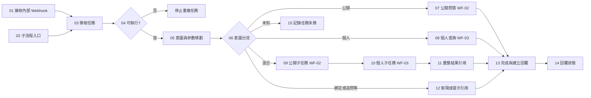
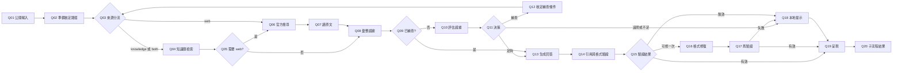
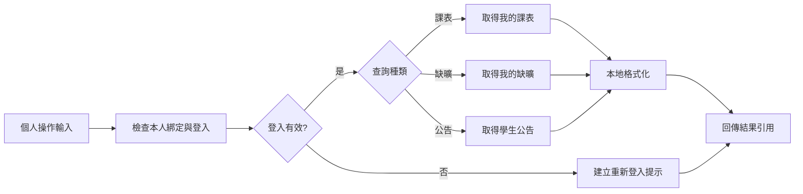
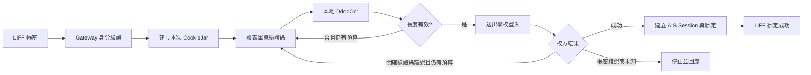

# n8n 節點工作流設計

版本：0.2；2026-10-05。配合 [SDD v0.3](SDD.md) 與 [ROADMAP](ROADMAP.md)。

這是節點契約基線。Phase 1 已建立 `workflows/WF-01.json`～`WF-07.json` 與合成 Gateway；實際匯入、執行與網頁驗收狀態依 [部署 runbook](runbooks/n8n-import.md) 及驗證紀錄，不以 JSON 存在認定完成。

## 1. 網頁交付要求

- Linux 上以 Docker Compose 執行 n8n，透過私人管理入口在瀏覽器開啟 editor。
- 交付 editor URL、每個 workflow 的實際 `/workflow/<id>` URL、無 secret 的匯出 JSON、workflow ID 對照表與執行驗收紀錄。不能用自畫 HTML 模擬 n8n editor。
- 主流程從左到右，公開／個人／混合分支分列，上方為正常路徑，下方為錯誤路徑；節點中文名稱，保留本文穩定 ID。
- Sticky Note 分區：接收與授權、意圖規劃、公開問答、個人查詢、回覆、異常處理。註記輸入／輸出與呼叫的 API。
- 展示時能開啟子流程、查看每個節點設定與假資料執行輸出。真實流量仍關閉 execution data 保存，不為展示改成保存真實私人資料。
- 所有節點 workflow 在選定 n8n 版本匯入成功後，才記錄 node `typeVersion`。本文不虛構尚未測試的 import compatibility。

## 2. 共用資料與執行規則

主流程收到的單一 item：

```json
{
  "taskId": "opaque-task-id",
  "requestId": "opaque-request-id",
  "taskCapability": "runtime-only-secret",
  "deadlineAt": "2026-10-05T16:01:30Z"
}
```

claim 後加 `leaseToken`；plan 加 `operations` 與 Gateway 指派的 `operationId`。子流程最後回傳原 task context＋`resultRefs`＋`status`，不得丟失主流程的身分上下文；HTTP Request 預設可能替換 item，須在節點明確映射回 context。敏感 headers 不記錄。

每個內部 HTTP 節點：

- URL 來自固定服務設定，不由模型／使用者輸入；service credential 由 n8n Credentials 管理。
- 帶 task capability、lease；API 對 task、action、operationId 作授權與去重。
- workflow 不另開自動重試；SDD 的 task 級 retry／deadline 預算由 Gateway 管理。
- HTTP 結果拆為業務結果與技術失敗。資料不足／未綁定是可呈現結果；網路失敗則走錯誤出口。
- 子流程開啟 Wait for Sub-Workflow Completion；每次傳一個已核定 operation。
- Switch 使用 Rules、互斥條件、單一匹配，啟用 fallback output，不能默默丟棄未知 intent。
- 個人資料、帳密、校方 Cookie 永不進 n8n item；只用 opaque refs。

## 3. WF-01：`campus-message-v1`

兩個互斥入口：production Webhook，以及供 WF-06 mock 展示呼叫的 Execute Sub-workflow Trigger；各次 execution 只由一個入口啟動。



| ID／節點名稱 | n8n 類型 | 關鍵設定／輸出 |
|---|---|---|
| M01 接收內部任務 | Webhook | POST `campus-message-v1`、Header Auth、立即回應；對外 LINE ACK 已由 Gateway 持久接收處理 |
| M02 子流程入口 | Execute Sub-workflow Trigger | 與 M01 相同欄位；限制可呼叫 workflow |
| M03 領取任務 | HTTP Request | `/tasks/:id/claim`，回 lease/state |
| M04 是否取得執行權 | If | 只有 claim=acquired 繼續，重複任務正常結束 |
| M05 意圖與參數規劃 | HTTP Request | `/tasks/:id/plan`；快捷操作可不呼叫 Gemini |
| M06 意圖分流 | Switch | public、personal（schedule/absence/announcements）、mixed、local（binding/clarify/unsupported）、fallback |
| M07 公開問答 | Execute Sub-workflow | WF-02，單一 public operation |
| M08 個人查詢 | Execute Sub-workflow | WF-03，單一 personal operation |
| M09 混合：公開 | Execute Sub-workflow | WF-02；保留 public resultRef |
| M10 混合：個人 | Execute Sub-workflow | WF-03；保留 public ref，再加 personal ref |
| M11 彙整引用 | Edit Fields | 只收集兩個 refs；不合併私人原文到模型 |
| M12 使用提示結果 | Edit Fields | 使用 plan 已準備的綁定／追問／不支援 resultRef |
| M13 完成並安排回覆 | HTTP Request | `/tasks/:id/complete`；驗證 refs，建立唯一 outbox |
| M14 完成狀態 | Edit Fields | `queued_for_delivery`；不把它標成學生已收到 |
| M15 回報可處理錯誤 | HTTP Request | `/tasks/:id/fail`，只傳 allowed error code |

M03 的技術失敗由 error workflow／watchdog 處理；尚未拿到 lease 不呼叫需要 lease 的 fail。M05–M13 的技術失敗走 M15；M15 再失敗時由 WF-04 接手，不造成錯誤迴圈。

混合問題第一版採順序執行，避免在 n8n 用 Merge 等待未啟動的 Switch 分支。未綁定可形成提示 ref，與公開答案一起回；單一 provider 技術失敗仍可採已完成的另一結果＋明確失敗提示，但必須由 Gateway 核定 partial result，不能自行假裝完整成功。

## 4. WF-02：`campus-public-qa-v1`

公開知識庫設計與硬上限見 [RAG.md](RAG.md)。下列替換 v0.1 的單純搜尋節點；穩定 ID 自本版本固定。



| ID | 節點／類型 | 責任 |
|---|---|---|
| Q01 | 公開輸入／Sub-workflow Trigger | task context＋operationId |
| Q02 | 準備路徑／HTTP | public/prepare；queryRef、route、iteration、freshnessRequired |
| Q03 | 來源分流／Switch | knowledge/both→Q04；web→Q06；fallback→Q18 |
| Q04 | 知識庫檢索／HTTP | public/knowledge；query embedding、關鍵字＋向量融合，回 knowledgeRef/count/degraded |
| Q05 | 需要網頁／If | route=both 才跑 Q06，其餘 Q08 |
| Q06 | 官方搜尋／HTTP | public/search；無候選也產空 searchRef，至 Q07 |
| Q07 | 讀官方原文／HTTP | public/read；空候選跳過抓取，回 evidenceRef/count |
| Q08 | 彙整證據／HTTP | public/collect；由 Gateway 彙整本 operation 已產 refs，去重及 token 上限 |
| Q09 | 已使用補查／If | iteration=1 至 Q13（API 本地檢查，無證據回不足）；否 Q10 |
| Q10 | 評估證據／HTTP | public/assess；最多一次模型評估，回 decision，不在 items 留原文 |
| Q11 | 決策／Switch | answer→Q13；retrieve→Q12；clarify/insufficient/fallback→Q18 |
| Q12 | 核定補查／HTTP＋If | public/rewrite-query；Gateway 配給 iteration=1、新 queryRef/route；有預算回 Q03，無預算 Q18 |
| Q13 | 生成答案／HTTP | public/generate；本地不足可直接回 fallback draftRef；模型可回 insufficient |
| Q14 | 驗證／HTTP | public/validate |
| Q15 | 驗證分流／Switch | valid→Q19，repairable→Q16，其他 Q18 |
| Q16 | 修格式／HTTP | public/repair；最多一次，截斷不修 |
| Q17 | 再驗證／HTTP＋If | valid→Q19，否 Q18 |
| Q18 | 追問／不足提示／HTTP | public/fallback；allowed reasonCode |
| Q19 | LINE 呈現／HTTP | public/render；回 resultRef |
| Q20 | 子流程結果／Edit Fields | context＋resultRefs＋status |

所有迴圈／模型／embedding／抓取預算由 Gateway 檢查；未執行分支不使用 Merge 等待。公開持久文件只存在知識庫；當次證據、草稿在短期 context，Brave results 不持久化。每次 HTTP 明確恢復 task context；技術失敗走主流程既定 fail／partial 策略，不偽裝來源不存在。

## 5. WF-03：`campus-personal-query-v1`



| ID | 節點／類型 | 責任 |
|---|---|---|
| P01 | 個人操作輸入／Sub-workflow Trigger | context＋operationId |
| P02 | 檢查本人 Session／HTTP Request | `personal/check-session`，active／reauth_required |
| P03 | 是否需要登入／If | 過期至 P09，正常至 P04 |
| P04 | 資料種類／Switch | schedule、absence、announcements；fallback 至 P09U `personal/unsupported-prompt` 產生不支援提示 |
| P05 | 我的課表／HTTP Request | `personal/schedule`；回 dataRef，不帶學號參數 |
| P06 | 我的缺曠／HTTP Request | `personal/absence`；學期由 operation 查回 |
| P07 | 學生公告／HTTP Request | `personal/announcements`；page/bid 由 operation 查回 |
| P08 | 本地呈現／HTTP Request | `personal/render`；校驗 task owner/version，再產 resultRef |
| P09 | 登入／失效提示／HTTP Request | `personal/login-prompt`；只產登入按鈕，不能把密碼送入 workflow |
| P10 | 子流程結果／Edit Fields | context＋resultRefs＋status |

P05–P07 必須自己再檢查 Session，P02 不是避免競態的唯一授權。查詢中發生 expiry 走 P09；校方維護／parser mismatch 走有原因的錯誤提示，不變成「沒有紀錄」。第一版無個人查詢的 Gemini 回填。

## 6. OCR 登入流程與 n8n 邊界



這張圖是 school-adapter 內部設計，不是把敏感步驟放進 n8n。三輪／30 秒上限同 SDD §5.2。開發展示可在 WF-03 Sticky Note 說明此邊界；mock 測試提供 `session_active`、`ocr_failed`、`credential_invalid` 狀態。真實登入結果由 LIFF 顯示，沒有額外的保存密碼功能。

## 7. WF-04、WF-05、WF-06

| Workflow | 節點連線 | 規則 |
|---|---|---|
| WF-04 `campus-workflow-error-v1` | Error Trigger → Edit Fields（只留 workflow/execution ID、允許的 code）→ HTTP 記錄監控事件 | 不傳整個 error 物件；無 task context 時由 execution mapping/watchdog 找任務；不自我掛為 error workflow |
| WF-05 `campus-maintenance-v1` | Schedule Trigger（5m）→ HTTP 清理過期資料 → HTTP aggregate health → If 異常 → 記錄維運事件 | endpoint 僅 maintenance service credential；不查學生課表，不做訂閱推播 |
| WF-06 `campus-demo-v1` | Manual Trigger → Edit Fields（scenario）→ HTTP 建立合成任務 → Execute WF-01 → HTTP 讀取 mock delivery 狀態 → Edit Fields 展示 | 僅 staging 啟用；production 不接受 demo endpoints，也不能由使用者輸入開啟 mock 模式 |

WF-06 另含 knowledge_success、web_success、both_success、retrieval_retry、retrieval_exhausted、stale_knowledge、source_conflict、embedding_unavailable；同步另由 WF-07 的 staging mock 驗證 unchanged/updated/withdrawn/failed。WF-06 scenario 至少含：public_success、public_no_source、schedule_success、absence_success、announcements_success、reauth_required、mixed_partial、provider_timeout、duplicate_event、ocr_failed、credential_invalid。OCR 錯誤場景使用合成 Session 結果，不在 n8n 傳假密碼以免形成錯誤範本。

## 7.1 WF-07：`campus-knowledge-sync-v1`

獨立於使用者 task，使用 knowledge-only service credential；正式資料只見 refs／counts。首次匯入及每日同步共用相同路徑。

| ID | 節點／類型 | 連線與契約 |
|---|---|---|
| K01/K02 | Schedule（每日）／Manual Trigger | 互斥入口→K03 |
| K03 | 領取同步／HTTP | POST /internal/v1/knowledge/sync/start → syncRef、acquired；未取得就結束 |
| K04 | 下一登錄來源／HTTP | POST /internal/v1/knowledge/sync/next，syncRef→sourceRef/done；done→K10 |
| K05 | 抓取與 hash／HTTP | POST /internal/v1/knowledge/sync/fetch；sourceRef→changed/unchanged/unavailable/withdrawn；changed→K06，其餘 K09 |
| K06 | 解析與切段／HTTP | POST /internal/v1/knowledge/sync/parse → versionRef；失敗 K09 |
| K07 | embedding 批次／HTTP＋If | POST /internal/v1/knowledge/sync/embed → batchDone/versionDone；未完且有預算重入，完成 K08，否 K09 |
| K08 | 驗證及發布／HTTP | POST /internal/v1/knowledge/sync/publish；transaction 切換 active version，失敗不切換 |
| K09 | 記錄來源狀態／HTTP | POST /internal/v1/knowledge/sync/record；記錄／失效處理，回 K04；到同步期限至 K10 |
| K10 | 完成／HTTP | POST /internal/v1/knowledge/sync/finish；計數、成本、續跑游標 |

所有 endpoint 只接受 syncRef/sourceRef/versionRef 與允許狀態碼；來源、批次游標及預算由 Gateway 配給。K03 後的技術失敗交 WF-04，同步 lease 過期可恢復，不公開半成品。WF-07 execution timeout 設 600 秒並將部署 EXECUTIONS_TIMEOUT_MAX 調為 600；使用者 WF-01～03 仍限 100 秒與 Gateway 90 秒 deadline，其餘沿用原設定。同步與查詢分開限流，避免批次占滿模型槽。

## 8. 分階段 API（補充 SDD §10.2）

所有下列路徑前綴為 `POST /internal/v1/tasks/:taskId/`，共用 service auth＋task capability＋lease。body 只接受 operationId 及本任務產出的 ref；不接受網域、學號、密碼、recipient。Gateway 從任務 context 取回完整資料。

| 路徑 | Input | Output |
|---|---|---|
| `public/prepare` | operationId | queryRef、route、iteration、freshnessRequired |
| `public/knowledge` | operationId、queryRef | knowledgeRef、count、degraded |
| `public/collect` | operationId | evidenceRef、count、iteration |
| `public/assess` | operationId、evidenceRef | decision、assessmentRef |
| `public/search` | operationId、queryRef | searchRef、candidateCount、remainingSearches |
| `public/rewrite-query` | operationId、assessmentRef | 核定 queryRef、route、iteration、allowed |
| `public/read` | operationId、searchRef | evidenceRef、count |
| `public/generate` | operationId、evidenceRef | draftRef |
| `public/validate` | operationId、draftRef | valid／repairable／invalid、draftRef |
| `public/repair` | operationId、draftRef | draftRef |
| `public/fallback` | operationId、allowed reasonCode | 本地提示 draftRef |
| `public/render` | operationId、draftRef | resultRef |
| `personal/check-session` | operationId | active／reauth_required |
| `personal/schedule`、`personal/absence`、`personal/announcements` | operationId | dataRef 或結構化錯誤 |
| `personal/render` | operationId、dataRef | resultRef |
| `personal/login-prompt`、`personal/unsupported-prompt` | operationId | resultRef |

從前版單一 `public-answer`／`personal-query` 改成以上 stage API；第一版不重複保留兩套編排 endpoint。每個 stage 保存結果與進度以支援重送；action 唯一鍵為 `(taskId, operationId, stage, iteration)`，iteration 由 Gateway 配給且有上限，不能由外部任意增加。

增加非任務型內部 endpoint：`POST /internal/v1/maintenance/cleanup`、`GET /internal/v1/maintenance/health`、`POST /internal/v1/observability/workflow-errors`，各有最小權限 service credential。只在測試環境提供 `POST /internal/v1/demo/tasks`、`GET /internal/v1/demo/tasks/:id/delivery`，使用獨立 mock credential 與 outbound deny，禁止送到真 LINE／學校／付費 API。

## 9. 匯入、展示與驗收順序

1. 先建 WF-02／03／04／05／07，再建 WF-01，最後 WF-06，回填實際 subworkflow ID。
2. 匯入後確認所有 nodes 無 unknown type／缺少參數，設定 Credentials mapping，publish 所需 workflow。
3. 開啟主流程與子流程的真實 editor URL，逐項展示節點、分支、HTTP 契約及 Sticky Note。
4. 用 WF-06 跑合成場景，查看父／子 execution 路徑、假結果、失敗分支；提供 scenario→execution ID→pass/fail 清單。
5. Phase 2–5 逐步替換 mock adapter，保留畫布節點與契約；每 phase 都在相同網頁工作流展示已接通的路徑。
6. 真實學生流量不開 execution data 留存；測試展示使用獨立 n8n staging instance／DB，才可短期保存合成 execution 供查看，並在 24h 清除。

參考：[Execute Sub-workflow](https://docs.n8n.io/integrations/builtin/core-nodes/n8n-nodes-base.executeworkflow/)、[Switch](https://docs.n8n.io/integrations/builtin/core-nodes/n8n-nodes-base.switch/)。研究日 2026-10-05；實際匯入相容性尚待 Phase 1。
