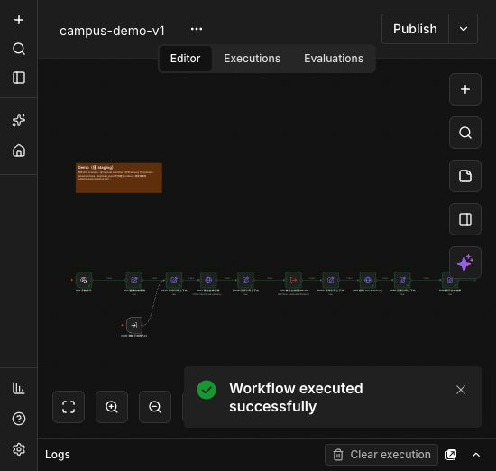

# Phase 1 本機驗收（2026-10-06）

**本機版通過；遠端交付延後。** 依使用者最新指示，先在本機 Docker 實作與驗證。遠端先前的試建容器已停止，不能把本紀錄當遠端驗收。

## 可操作成果

- [本機 n8n Demo](http://localhost:15679/workflow/campusWF06phase1)
- [主流程](http://localhost:15679/workflow/campusWF01phase1)
- 其餘 5 個 workflow URL、Credentials mapping、匯入／發布／匯出步驟見 [runbook](../runbooks/n8n-import.md)。
- n8n 2.41.7，所有基底 image 固定 digest；n8n／mock／PostgreSQL 位於禁止外連的 internal network。管理 proxy 僅 host loopback。

## 驗證結果

| 檢查 | 結果／證據 |
|---|---|
| TypeScript typecheck、build | 通過 |
| 真 HTTP API 測試（未 mock service） | 11／11；跨 task／lease／operation／ref、scope、嚴格 body、deadline、去重、失敗與同步 |
| 工作流圖、文件連結與模組邊界 | 7 個圖通過；`pnpm check` |
| 真 n8n import | 6 credentials、7 workflows 成功匯入 |
| node typeVersion | 逐顆比對 n8n 已登錄 schema；無 unknown type/version |
| WF-06 合成情境 | 30／30，見 [runtime-results.json](runtime-results.json)；每個終態的 outboxCount 都是 1、delivered=false |
| 知識同步 | WF-07 execution 111：updated=1、unchanged=1、withdrawn=1、failed=1，僅 1 個合成版本發布 |
| 維護／錯誤手動 fixture | executions 112／113 通過；WF-04 手動入口使用 n8n 內建合成 ErrorTrigger 資料 |
| 真 Webhook → 自動 ErrorTrigger | 無憑證回 403；有憑證的合成無效任務回 ACK 200 後失敗，WF-04 execution 98，mode=error；監控僅留三個核定欄位 |
| pgvector | 0.8.2；同向量 L2 distance=0 |
| DB 隔離／outbound deny | n8n DB user 不能 CONNECT campus；n8n 與 mock 對外 TCP 被拒絕 |
| 匯出一致性 | 7 份 live graph 與匯出 graph 對照來源一致；n8n API 省略預設 executionTimeout=100 時按實際全域預設比較 |
| 服務重啟 | n8n 與 mock 重啟後恢復；工作流／credentials 保留；4 個代表情境與 WF-04／05／07 再次通過 |
| 瀏覽器實跑 | 真 editor 按 Execute workflow，execution 114 成功，子流程 115／116 成功；D06 顯示 completed／answered／synthetic=true／outboxCount=1／delivered=false |
| Secret 檢查 | Git 可見檔案不含此環境生成的管理者或 service token |

版本、工作流 ID、node types、來源 SHA-256 見 [runtime-manifest.json](runtime-manifest.json)。重啟情境見 [post-restart-results.json](post-restart-results.json)，系統流程見 [system-results.json](system-results.json)，自動錯誤見 [webhook-results.json](webhook-results.json)。

## 畫布證據

實際以瀏覽器開啟主流程、公開、個人、錯誤、維護、demo、知識同步。主流程分列 public／personal／mixed，下方為失敗出口；所有 Switch 皆有 fallback。相容性以 runtime execution 加上 schema registry 比對為證，不只看畫布截圖。

[主流程](WF-01.jpg)、[公開問答](WF-02.jpg)、[個人查詢](WF-03.jpg)、[錯誤監控](WF-04.jpg)、[維護](WF-05.jpg)、[知識同步](WF-07.jpg)、[最終結果面板](WF-06-result.jpg)。

## 邊界與未執行項目

- 這是本機合成資料版。LINE、LIFF、Gemini、Brave、學校登入／OCR、真實 RAG、學生資料均未接通，屬後續 phase。
- Mock task／sync store 在 memory，重啟清空；不是 Phase 2 的 PostgreSQL transaction/outbox 保證。合成 `source_conflict` 只驗證 both 分支，不證明模型能正確說明衝突。
- execution 保存僅允許此獨立 synthetic instance，24 小時清理。正式環境必須取消 execution data 保存並關閉 demo。
- WF-05／07 的排程尚未發布，目前手動驗收；WF-01／02／03／04 已發布以支援巢狀執行及自動錯誤處理。
- 完成一輪 30 情境、重啟及瀏覽器驗收；尚未長時間運行觀察，亦不是 Phase 6 的負載／真實試用驗收。
- 遠端 Ubuntu 主機尚未交付，保留停止狀態。Git origin 已設定，未 commit／push。
- 此輪由同一實作者自驗，沒有獨立代理審查。
